# 公開登録データに基づく低圧 Ar/CF4 プラズマ反応ネットワーク自動生成手法の設計と検証

> Status: historical Ar/CF4 technical report. It may not list newer Phase 1-6
> CLI additions such as `export-dnt` and `infer-candidates`; use `README.md`
> and `docs/product_architecture.md` for the current product entry point.

日付: 2026-05-12  
著者: [川人大希]

## 0.概要

本報告では、低圧プラズマ反応機構の構築を支援する `plasma-reactgen` の設計、登録データ仕様、および Ar/CF4 テストケースでの生成結果を整理する。本コードは、登録済みの化学種、電子衝突反応チャネル、イオン中性衝突反応チャネルを入力として、反応ネットワーク、状態種リスト、DNT+/DNT+DM 計算準備タスク、coverage report、missing-data report を自動生成する。

本実装の主目的は、断面積や速度係数を直接計算することではなく、公開データに基づく反応チャネル登録と、低圧プラズマ反応ネットワーク構築の再現性を高めることである。Ar/CF4 ケースでは、入力ガス Ar と CF4 から深さ 2 まで frontier 展開を行い、12 状態種、42 反応、12 DNT task を生成した。生成された 42 反応は、登録済み 43 チャネルのうち `deprecated` とされた 1 チャネルを除いた結果であり、全反応で species 参照、電荷収支、元素収支が検証を通過している。

本報告の読み方として、0--2章では本手法の目的とプラズマ物理上の意義を述べる。3--4章では、実際のコード構成と登録データ仕様を説明する。5章では、Ar/CF4 ケースの出力を物理的に解釈し、単なるグラフ一覧ではなく、何が生成され、何が未登録で、どのデータが次の研究作業になるかを明確化する。最後に、拡張機能として現行のワークフローと将来のデータ同化ワークフローを対比する。

| 項目 | Ar/CF4 テストケース結果 |
|---|---:|
| 入力ガス | Ar, CF4 |
| 最大展開深さ | 2 |
| 生成状態種数 | 12 |
| 生成反応数 | 42 |
| 電子衝突反応数 | 16 |
| イオン中性衝突反応数 | 26 |
| coverage found pair | 17 |
| coverage missing pair | 23 |
| DNT task 数 | 12 |
| missing-data item 数 | 19 |

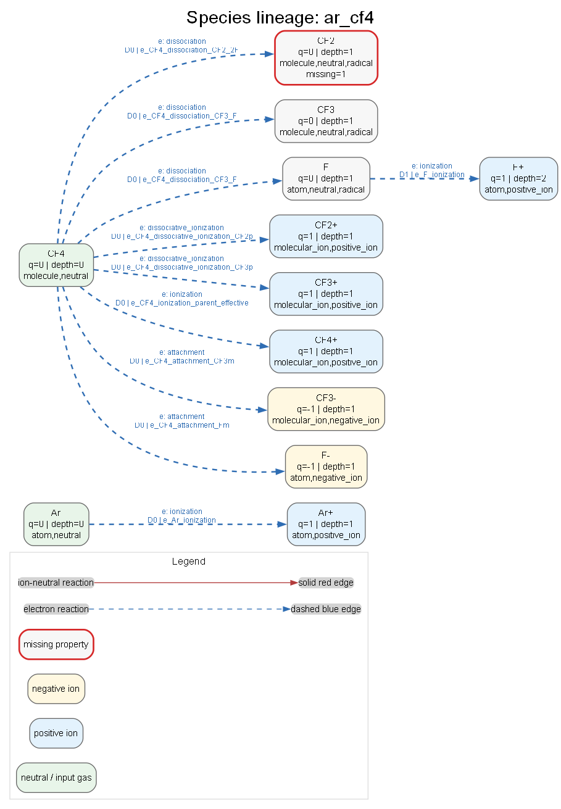

*図0-1: 入力ガスから生成状態種へ至る species lineage。CF2 は DNT 用 dipole moment 欠損により赤枠で示される。*

## 1.背景

低圧プラズマの化学反応機構は、電子衝突、イオン中性衝突、解離、電離、付着、電荷移行、反応性散乱などの多様な素過程を含む。Ar/CF4 系のようなエッチング関連プラズマでは、CF4 の電子衝突解離により CF3、CF2、F、F-、CF3+ などが生成され、さらに Ar+、CF3+、CF4+、F+、F- と中性種の衝突が二次的な反応ネットワークを形成する。

プラズマシミュレーションでは、反応式の正しさだけでなく、各反応に対応する断面積、閾値、反応エネルギー、状態種物性、出典、品質フラグが重要である。電子衝突断面積は LXCat や個別文献から得られることが多く、分子種の熱化学やイオン化エネルギーは NIST Chemistry WebBook、NIST Atomic Spectra Database、NIST CCCBDB などの評価データベースが参照されることが多い [1-4]。一方、イオン中性反応の断面積は電子衝突ほど体系的に揃っていない場合があり、DNT+ のようなモデルを用いて不足データを補う意義がある [8]。

従来、反応機構の構築は文献値、断面積 DB、既存シミュレーション入力ファイル、研究者の経験的判断を手作業で統合する場合が多い。この方法は柔軟である一方、登録根拠、欠損データ、非推奨チャネル、生成種の伝播条件が暗黙化しやすい。本コードは、反応機構生成をファイル登録型のデータ処理として扱い、登録、検証、欠損診断、可視化を一貫したワークフローにする。

| 課題 | 従来の作業で起こりやすい問題 | 本コードでの扱い |
|---|---|---|
| 状態種登録 | 種名、電荷、組成、物性値の表記揺れ | species YAML に `id`, `composition`, `charge`, `classes`, `properties` を明示 |
| 反応チャネル登録 | 反応式とデータ出典の分離、非推奨反応の混入 | reaction YAML に products, status, data source を登録し、`deprecated` を除外 |
| ネットワーク展開 | どの生成種を次段の衝突対象にするかが不透明 | frontier strategy と profile により伝播対象を制御 |
| 物理検証 | 電荷収支、元素収支の見落とし | species 参照、電荷収支、元素収支を自動検証 |
| 欠損データ | 断面積未導入や DNT 用物性欠損が後工程で発覚 | missing-data report と DNT readiness に集約 |
| 可視化 | 反応リストだけでは展開経路や coverage が把握しにくい | 統計 SVG と Graphviz ネットワークを生成 |

本コードの位置づけは「反応断面積をすべて決定するコード」ではなく、「プラズマ反応機構の登録状態、整合性、欠損、拡張余地を明示する基盤」である。この境界を明確にすることで、研究者は生成済み反応リストをそのままブラックボックスとして受け取るのではなく、どの反応が登録済みで、どの物性・断面積が未導入かを確認しながらモデルを発展させられる。

## 2.本手法の技術と効果

本手法は、入力ガスを起点として登録済み反応ペアを探索し、反応生成物を新たな候補状態種として展開する。展開対象は profile により制御され、低圧プラズマ向け profile では neutral、radical、positive ion、negative ion を伝播対象とし、励起状態の伝播はデフォルトで抑制する。

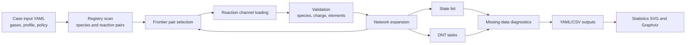

frontier 展開の利点は、入力ガスから直接登録されている反応だけでなく、電子衝突などで生成された fragment や ion を次段の衝突対象へ進められる点である。例えば CF4 から CF3、CF2、F、F-、CF3+ などが生成されると、それらは profile の class 条件に従って frontier に入り、登録済みの ion-neutral pair があれば新たな反応が生成される。この仕組みにより、登録済みデータの範囲内で「どこまで反応ネットワークが広がるか」を機械的に再現できる。

| 処理 | 技術内容 | 期待される効果 |
|---|---|---|
| Frontier 展開 | 入力ガスおよび生成種を frontier として衝突ペアを選択 | 反応ネットワークを登録データから再帰的に構築 |
| Role-based state diagnostics | electron target, DNT neutral, DNT ion などの role を状態種に付与 | 後工程に必要な物性値の欠損を role ごとに発見 |
| Reaction validation | species reference、charge balance、element balance を検査 | 反応式登録ミスをネットワーク生成時に排除 |
| Data policy filtering | allowed status と exclude status に基づき channel を採否判定 | draft や estimated を許容しつつ deprecated を除外 |
| DNT task generation | ion-neutral 反応から ion/neutral pair を抽出 | DNT+/DNT+DM 計算へ渡すべき pair と channel を一覧化 |
| Visualization | 統計チャートと species graph を生成 | 物理モデルの coverage、欠損、展開経路を短時間で点検 |

本手法の効果は、反応機構の「生成」と「監査」を同時に行える点にある。生成された reaction network は CSV/YAML として利用できる一方、coverage report と missing-data report は、次に追加すべき登録データを示す研究計画表として使える。特に Ar/CF4 のように電子衝突とイオン中性衝突の両方が重要な系では、反応数そのものよりも、どの反応 family がどの深さで増え、どの物性が DNT 準備状態を制限しているかを把握することが重要である。

## 3.本コードの構成とワークフロー

コードは、domain、application、infrastructure、interface、visualization に分けられている。生成器の中核は application 層にあり、ファイルレジストリから読み込んだ domain model を用いて反応ネットワークを構築する。visualization 層は後処理として生成済み YAML/JSON を読み込むため、反応生成ロジックとは疎結合である。

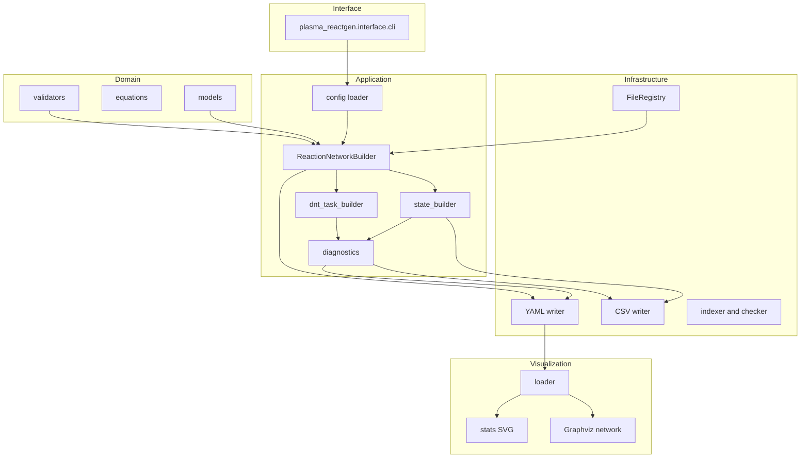

| 層 | 主な役割 | 代表的な出力または責務 |
|---|---|---|
| `domain` | species、reaction、network のデータモデルと反応式整形 | `Species`, `ReactionChannel`, `GeneratedReaction` |
| `application` | case config 解釈、反応ネットワーク生成、state/DNT/missing data 構築 | `ReactionNetwork`, state list, DNT tasks |
| `infrastructure` | YAML/CSV 読み書き、ファイル registry、registry check | output YAML/CSV、index file |
| `interface` | CLI エントリポイント | `generate`, `visualize`, `dev-check`, `template` |
| `visualization` | 生成済み output の統計図と Graphviz 図作成 | `statistics/*.svg`, `network/*.png`, `manifest.json` |

CLI ワークフローは以下の通りである。`dev-check` は registry の基本整合性を確認し、`generate` は case input から反応ネットワークを生成する。`visualize` は生成済み output を読み込み、統計図と network 図を生成する。`template` は新規 species や reaction pair の登録テンプレートを出力する。

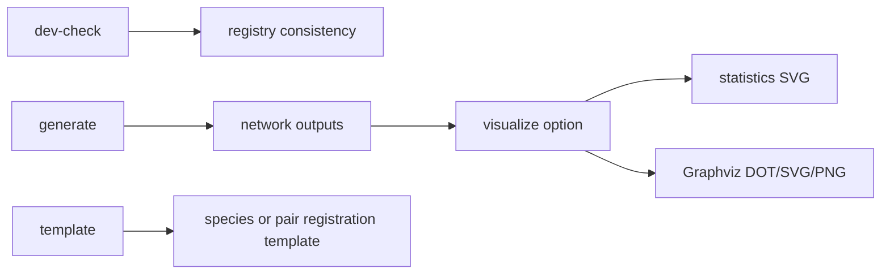

実務上は、まず `dev-check --strict` で登録ファイルの読み取りと参照整合性を確認し、次に `generate` で output を作り、最後に `visualize` で図を確認する流れになる。登録データを追加した場合は、反応数が増えるかどうかだけでなく、missing pair が減ったか、missing-data item が減ったか、DNT readiness が改善したかを同時に確認する。

## 4.本コードの入力、登録データ仕様

本コードの入力は case YAML と registry である。case YAML は対象ガス、profile、展開深さ、出力種別、data policy を指定する。registry は species、reaction pair、rules、profile、data notes、sources から構成される。

### 4.1 Case input

Ar/CF4 ケースの入力は `cases/ar_cf4/input.yaml` である。このファイルは研究対象を固定する「実験条件表」に相当する。すなわち、初期ガス、展開深さ、許容する登録品質、出力する成果物を明示し、同じ registry に対して同じ network を再生成できるようにする。

| フィールド | Ar/CF4 ケース値 | 意味 |
|---|---|---|
| `case.name` | `ar_cf4` | case 識別名 |
| `gases` | `Ar`, `CF4` | 初期入力ガス |
| `profile` | `low_pressure_plasma_v1` | 展開規則と衝突ペア選択規則 |
| `expansion.max_depth` | `2` | frontier 展開深さ |
| `outputs.reactions` | `true` | reaction YAML/CSV を出力 |
| `outputs.states` | `true` | state YAML/CSV を出力 |
| `outputs.dnt_tasks` | `true` | DNT task YAML を出力 |
| `outputs.coverage_report` | `true` | found/missing pair report を出力 |
| `outputs.missing_data` | `true` | 欠損データ report を出力 |
| `data_policy.allowed_status` | curated, literature_supported, estimated, draft | 生成対象 status |
| `data_policy.exclude_status` | deprecated | 生成除外 status |

### 4.2 Species registry

species YAML は状態種の最小物理情報と後工程に必要な補助物性を保持する。Ar/CF4 starter registry では、Ar、Ar+、CF4、CF4+、CF3、CF3+、CF3-、CF2、CF2+、F、F-、F+ が登録されている。熱化学、イオン化エネルギー、電子親和力、分極率などは、NIST 系データベースや文献値を基礎にしつつ、未確定値は `estimated` として扱われる [1-4]。

| 項目 | 例 | 目的 |
|---|---|---|
| `id` | `CF4`, `Ar+` | 反応式と registry 内の一意識別子 |
| `composition` | `{C: 1, F: 4}` | 元素収支検証 |
| `charge` | `0`, `1`, `-1` | 電荷収支検証と ion/neutral 判定 |
| `classes` | `neutral`, `radical`, `positive_ion` | frontier 展開と role assignment |
| `state` | ground/excited, label, energy | 状態種の識別 |
| `properties.mass_amu` | amu | DNT task、電子衝突 target role の required property |
| `properties.polarizability_A3` | A3 | DNT neutral readiness |
| `properties.dipole_moment_D` | D | DNT+DM variant 判定 |
| `metadata.status` | curated, estimated | 登録品質と運用上の注意 |

ここで重要なのは、species registry が「単なる分子量表」ではない点である。生成された状態種が electron target になる場合、DNT neutral になる場合、ion-neutral projectile になる場合で必要な物性は異なる。したがって state list では、各 species に role が付与され、その role に対して required property が足りているかが診断される。

### 4.3 Reaction pair registry

reaction YAML は projectile/target pair と複数 channel を保持する。電子衝突反応では threshold と cross-section reference、イオン中性衝突では `dnt_class` と反応エネルギーを登録する。Ar/CF4 ケースでは、CF4 の電子衝突解離や電離に関する文献情報、CF3+、F+、F- と CF4 のイオン分子反応、DNT+ で扱う Ar+--CF4 系が registry notes に反映されている [5-8]。

| family | pair 例 | channel 例 | 主な用途 |
|---|---|---|---|
| `electron` | `e + CF4` | elastic, ionization, dissociation, attachment | 電子衝突による生成種展開 |
| `electron` | `e + CF3`, `e + CF2`, `e + F` | fragment target reaction | 生成 fragment の二次展開 |
| `ion_neutral` | `Ar+ + CF4` | elastic, dissociative charge transfer | DNT task とイオン反応経路 |
| `ion_neutral` | `CF3+ + CF4`, `F- + CF4` | charge transfer, detachment | イオン中性反応 coverage |

### 4.4 Rule/profile registry

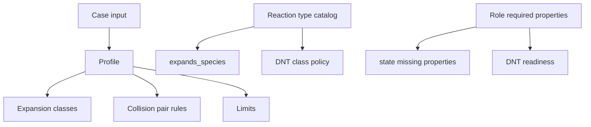

| Registry rule | 役割 | Ar/CF4 ケースでの効果 |
|---|---|---|
| `profiles/low_pressure_plasma_v1.yaml` | 展開深さ、伝播 class、衝突 family を指定 | neutral/radical/ion を frontier に入れる |
| `reaction_type_catalog.yaml` | reaction type ごとの `expands_species` を指定 | elastic/excitation は状態種展開しない |
| `role_required_properties.yaml` | role 別 required/recommended property を指定 | CF2 の `dipole_moment_D` 欠損を検出 |
| `data_policy` | allowed/excluded status を指定 | `deprecated` channel を生成対象から除外 |

rule/profile registry は、物理モデル上の選択をコードから切り出す役割を持つ。例えば、励起状態を伝播するか、どの class を electron target にするか、elastic channel が生成種展開を行うかは、反応ネットワークの大きさと意味を大きく変える。これらを profile と catalog に分離することで、同じ species/reaction registry に対して異なるモデリング方針を比較しやすくなる。

## 5.本コードによるテストケースでの入出力説明と考察(Ar_CF4)

### 5.1 ケース設定と物理的ねらい

Ar/CF4 ケースは、低圧プラズマ反応ネットワーク生成と DNT+/DNT+DM 前処理の starter registry として設計されている。CF4 はエッチングプロセスで代表的なフッ素系ガスであり、電子衝突により F、CF3、CF2、負イオン、正イオンを生成する。Ar は希釈ガス、励起・電離源、Ar+ による電荷移行反応の入口として機能する。

このテストケースで確認したい点は三つある。第一に、入力ガスから fragment と ion が期待通り展開されるか。第二に、登録反応が電荷・元素収支を満たすか。第三に、実用シミュレーションへ進む前に必要な断面積 table や DNT 用物性値の欠損が明示されるかである。

| 分類 | 実装済み | 本ケースでの扱い |
|---|---|---|
| 反応ネットワーク生成 | はい | 登録 channel から 42 反応を生成 |
| 物理検証 | はい | species 参照、電荷収支、元素収支を検証 |
| DNT task 抽出 | はい | 12 ion-neutral pair を task 化 |
| 数値 electron cross-section import | いいえ | `data.cross_section.path` は多くが未設定 |
| DNT+/DNT+DM 断面積計算 | いいえ | readiness と channel list のみ出力 |
| 公開 DB 自動取得 | いいえ | 将来拡張として扱う |

### 5.2 生成物の概要

| 出力ファイル | 内容 | 主な用途 |
|---|---|---|
| `network.reactions.yaml/csv` | 生成反応、反応式、family、type、validation | 反応機構の主出力 |
| `network.states.yaml/csv` | 状態種、role、欠損物性、伝播有無 | 状態種管理と後工程準備 |
| `dnt_tasks.yaml` | ion-neutral pair、DNT readiness、channel list | DNT+/DNT+DM 前処理 |
| `coverage_report.yaml` | candidate pair の found/missing | registry coverage 点検 |
| `missing_data.yaml/csv` | species/property、asset、DNT task の欠損 | 追加データ収集の優先順位付け |
| `summary.json` | 主要 count | CI やレポート生成用のサマリ |

| 指標 | 値 |
|---|---:|
| 生成状態種数 | 12 |
| 生成反応数 | 42 |
| 電子衝突反応数 | 16 |
| イオン中性衝突反応数 | 26 |
| 最大到達深さ | 2 |
| coverage found pair | 17 |
| coverage missing pair | 23 |
| DNT pair | 12 |
| DNT ready pair | 10 |
| DNT missing-properties pair | 2 |
| missing-data item | 19 |

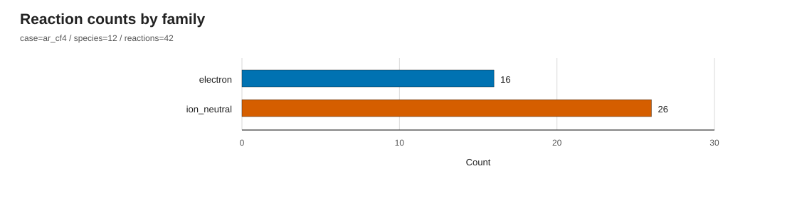

*図5-1: 生成反応の family 別内訳。電子衝突反応 16 件、イオン中性衝突反応 26 件である。*

図5-1は、Ar/CF4 ケースにおいてイオン中性反応の登録数が電子衝突反応より多いことを示す。ただし、これは「イオン中性過程が必ず支配的である」ことを意味しない。ここで示されるのは登録済み channel 数であり、実際の寄与は断面積、電子エネルギー分布、イオンエネルギー分布、密度に依存する。本コードは、その前段階として、モデルに含める候補反応を整合的に列挙する。

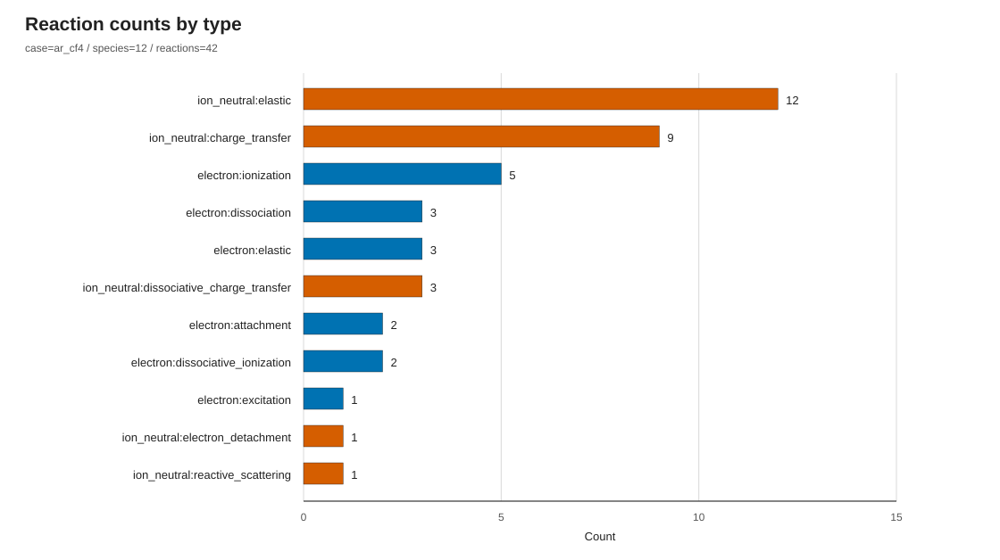

*図5-2: reaction type 別内訳。色は reaction family に対応し、electron は青、ion-neutral は橙赤で統一されている。*

| 反応タイプ | 件数 | 考察 |
|---|---:|---|
| ion_neutral:elastic | 12 | DNT/transport 前処理の基本 channel。状態種展開には寄与しない。 |
| ion_neutral:charge_transfer | 9 | 生成 ion と neutral の電荷移行経路を表す。 |
| electron:ionization | 5 | Ar、CF4、fragment の正イオン生成を担う。 |
| electron:dissociation | 3 | CF4/CF3 から中性 radical を生成する。 |
| electron:elastic | 3 | 電子輸送に必要だが、状態種展開には寄与しない。 |
| ion_neutral:dissociative_charge_transfer | 3 | CF4 や fragment を伴う解離性電荷移行を表す。 |
| electron:attachment | 2 | F-、CF3- など負イオン生成に関係する。 |
| electron:dissociative_ionization | 2 | CF3+、CF2+ と F を同時に生成する。 |
| electron:excitation | 1 | Ar excitation の lumped channel。 |
| ion_neutral:electron_detachment / reactive_scattering | 各1 | F- detachment や fragment 生成の補助経路。 |

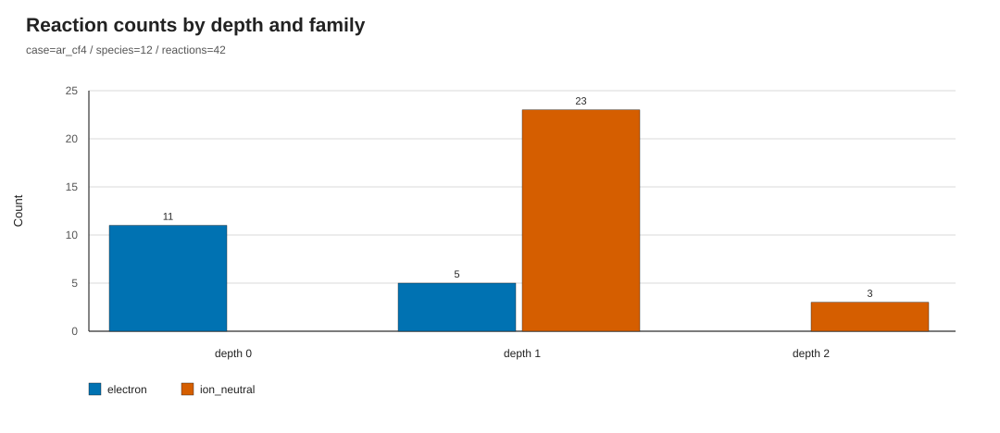

*図5-3: 展開深さごとの反応数。depth 0 では主に入力ガスに対する電子衝突、depth 1 以降では生成 ion/neutral を含む ion-neutral reaction が増える。*

depth 0 は入力ガス Ar、CF4 を直接 target とする電子衝突が中心である。ここで生成された Ar+、CF3、CF2、F、F-、CF3+、CF2+、CF4+ が depth 1 の候補になる。depth 1 では、これらの ion/neutral pair に対して登録済みの ion-neutral channel が生成される。depth 2 では、さらに F+ など二次的に導入された species を含む反応が少数生成される。この分布は、frontier 展開が「入力ガスの電子衝突」から「生成種間のイオン中性反応」へ段階的に移ることを示している。

### 5.3 反応生成と検証

Ar/CF4 registry には 43 reaction channel が登録されている。このうち `Arp_CF4_charge_transfer_parent_surrogate` は `deprecated` であり、case policy により除外される。したがって生成された 42 反応は、allowed status に該当し、かつ deprecated でない登録 channel と一致する。

| 検証項目 | 結果 | 解釈 |
|---|---:|---|
| species reference | ok: 42 | 全反応の reactant/product species が registry に存在 |
| charge balance | ok: 42 | 全反応で電荷収支が成立 |
| element balance | ok: 42 | 全反応で元素収支が成立 |
| registered channel | 43 | registry に存在する channel 総数 |
| generated allowed channel | 42 | `deprecated` を除く生成対象 channel |
| deprecated channel | 1 | parent CF4+ charge-transfer surrogate は生成から除外 |

ここで重要なのは、検証が「反応断面積の正しさ」を保証するわけではない点である。検証は、反応式が registry に存在する species だけで構成され、電荷と元素数が保存されることを保証する。断面積の品質、閾値の精度、反応分岐比の妥当性は、別途 source quality と numerical asset の検証が必要である。したがって、本検証は反応機構構築における第一段階の構文的・保存則的監査として位置付けられる。

### 5.4 状態種の展開

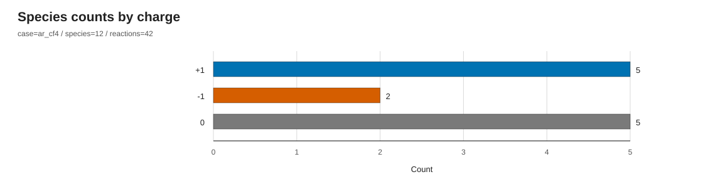

*図5-4: 状態種の電荷別分布。中性種、正イオン、負イオンが低圧 Ar/CF4 反応ネットワークの基本状態種として生成される。*

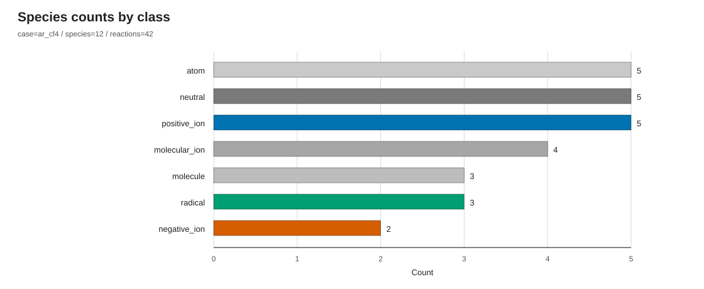

*図5-5: 状態種 class 別分布。neutral、ion、radical、atom/molecule 分類が frontier 展開と role assignment の基礎になる。*

*図5-6: species lineage。CF4 から CF3、CF2、F、CF3-、F-、CF3+、CF2+、CF4+ が生成され、Ar から Ar+ が生成される。F から F+ への二次展開も示される。*

図5-6は、CF4 が本ケースの主要な branching point であることを示す。CF4 の電子衝突 dissociation、attachment、dissociative ionization により、中性 radical、負イオン、正イオンが同時に導入される。Ar は電子衝突 ionization により Ar+ を導入し、この Ar+ が CF4、CF3、CF2、F などとの ion-neutral reaction の起点になる。

状態種展開の解釈では、生成種数の多さよりも、どの種が次段へ伝播されるかが重要である。現行 profile では neutral、radical、positive ion、negative ion が伝播対象であり、励起状態は伝播しない。したがって、Ar excitation channel は反応リストには存在しても、新しい frontier species を増やす役割は持たない。この設計により、過度に大きな励起状態ネットワークを避けつつ、化学反応に寄与しやすい ground-state fragment と ion を中心に展開できる。

### 5.5 Coverage と missing data

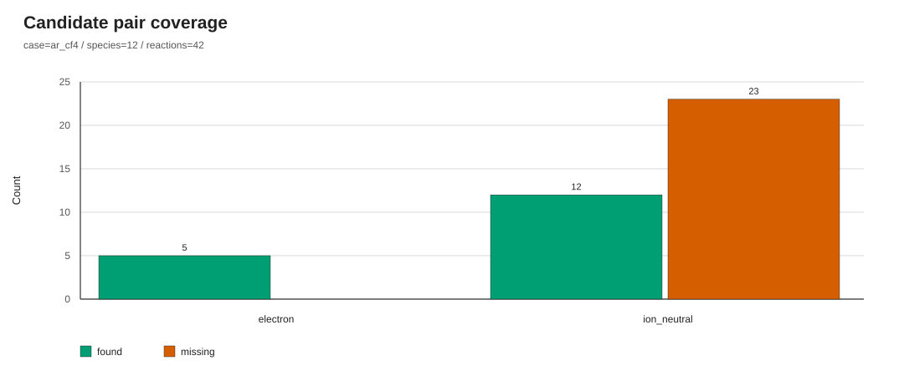

*図5-7: candidate pair coverage。found pair は 17、missing pair は 23 である。missing は登録が存在しない候補 pair を示し、必ずしも物理的に必要な反応の欠落を意味しない。*

coverage report は、frontier 展開で候補になった collision pair に対し、reaction YAML が登録されているかを示す。found pair は「登録済み反応ファイルがある pair」、missing pair は「候補にはなったが登録ファイルがない pair」である。missing pair は、物理的に必ず重要な反応を意味するわけではない。むしろ、registry coverage の空白を可視化し、追加登録の候補を洗い出すための診断である。

missing-data item は 19 件である。内訳は、電子衝突 cross-section table 未導入に関する warning が 16 件、CF2 の `dipole_moment_D` 欠損が species required property として 1 件、CF2 neutral を含む DNT task 欠損が 2 件である。

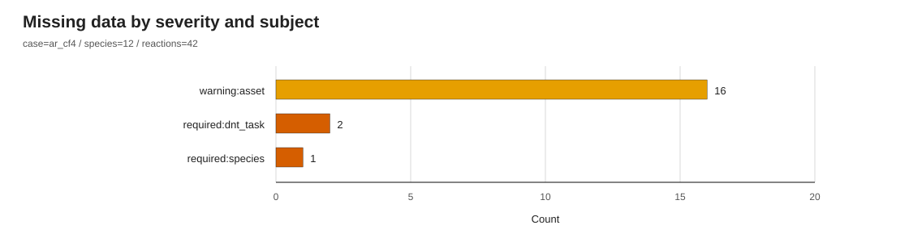

*図5-8: missing data の内訳。warning の多くは electron collision の数値 cross-section table 未導入に由来する。*

| 欠損種別 | 件数 | 物理的意味 | 対応方針 |
|---|---:|---|---|
| asset warning: `data.cross_section.path` | 16 | 電子衝突 channel の数値断面積テーブルが未 import | LXCat/NIST/文献 importer の導入 |
| species required: `CF2.dipole_moment_D` | 1 | CF2 neutral の DNT+DM variant 判定に必要 | 公開データまたは ab initio 値の登録 |
| DNT task required: `neutral.dipole_moment_D` | 2 | CF2 を neutral とする DNT task が未 ready | CF2 dipole moment 登録後に解消 |

現行 registry notes では、数値 cross-section array は意図的に同梱されていない。したがって、16 件の asset warning はコード実行エラーではなく、次に導入すべき numerical asset の一覧である。これは実務上重要であり、反応式だけを登録した状態と、PIC-MCC や Boltzmann solver に渡せる数値断面積まで揃った状態を明確に区別できる。

### 5.6 DNT+/DNT+DM task

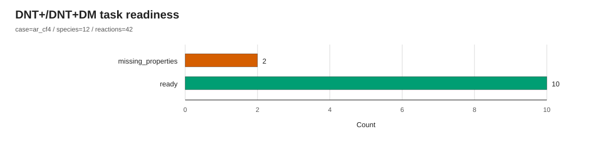

*図5-9: DNT task readiness。12 pair のうち 10 pair が ready、2 pair が missing properties である。*

| DNT readiness | pair | 理由 |
|---|---|---|
| ready | Ar+__Ar, Ar+__CF3, Ar+__CF4, Ar+__F, CF3+__Ar, CF3+__CF4, CF4+__Ar, CF4+__CF4, F-__CF4, F+__CF4 | ion と neutral の required property が揃う |
| missing_properties | Ar+__CF2, CF3+__CF2 | neutral CF2 の `dipole_moment_D` が未登録 |

DNT task は、ion-neutral reaction を下流の DNT+/DNT+DM 計算へ渡すための前処理リストである。現行コードは DNT 断面積を計算しないが、どの ion-neutral pair が計算候補であり、どの channel が含まれるかを整理する。CF2 を neutral とする pair が missing になる理由は、DNT+DM variant 判定に必要な dipole moment が未登録であるためである。これは、CF2 物性値の追加登録が DNT readiness を直接改善することを示している。

### 5.7 反応ネットワーク全体像

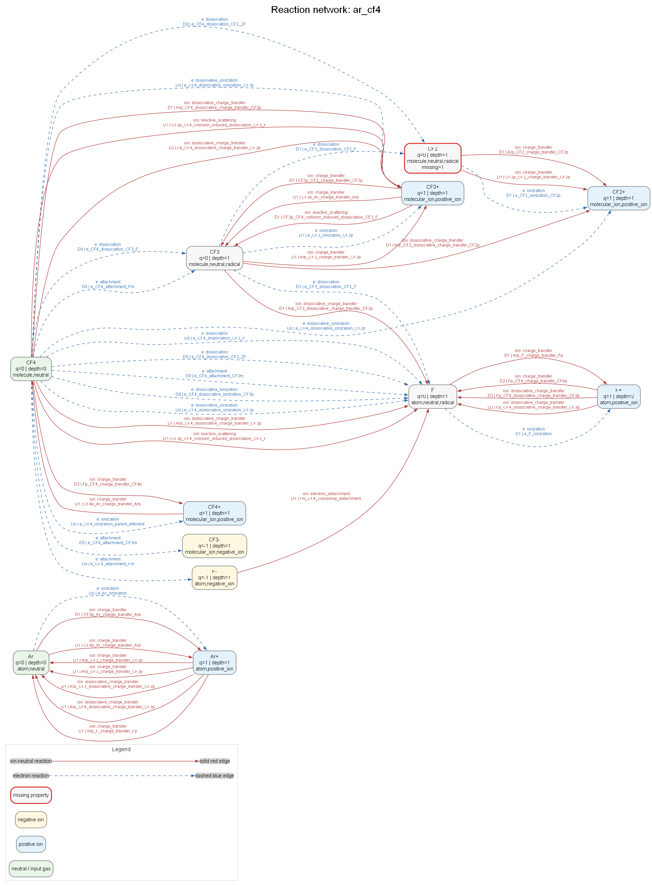

*図5-10: state-node reaction network。青破線は electron reaction、赤実線は ion-neutral reaction を示す。厳密な hypergraph ではなく、読みやすさのため species graph として描画している。*

図5-10では、CF4 が電子衝突により fragment と ion を生成し、それらが ion-neutral reaction の対象として反応経路を広げる様子が確認できる。電子衝突は主に状態種生成を駆動し、イオン中性衝突は生成済み ion と neutral の間の charge transfer、dissociative charge transfer、reactive scattering、electron detachment などを補う。

このネットワーク図は、反応機構の完全な数学的 hypergraph ではない。多生成物反応を読みやすい species graph に写像しており、反応式の完全な stoichiometry は `network.reactions.yaml/csv` に保持される。したがって、図は「反応経路の概観」として使い、保存則や生成物係数の確認は reaction output を参照するのが適切である。

## 拡張機能

以下は現在未実装の future work であり、現行コードの実装済み機能とは区別する。目的は、registry の手動登録を減らし、断面積データ、状態種登録、品質管理を閉ループ化することである。

### 現状: 現在のワークフロー

現行ワークフローでは、研究者が species YAML と reaction YAML を手動または半手動で登録し、`generate` がそれを読み込んで network output と diagnostics を生成する。missing-data report は出力されるが、その欠損を自動的に外部 DB へ問い合わせたり、registry patch を生成したりはしない。

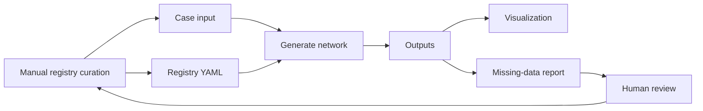

| 領域 | 現在地 |
|---|---|
| species 物性値 | YAML に登録済みの値のみ使用。未登録値は missing data として報告。 |
| 電子衝突断面積 | reaction channel identity と source label は保持するが、数値 table import は未実装。 |
| イオン中性断面積 | DNT task は生成するが、DNT+/DNT+DM による数値断面積生成は未実装。 |
| provenance | source 文字列と status は保持するが、取得日、DB version、変換履歴の機械管理は未実装。 |
| registry 更新 | missing data を人が確認し、手動で YAML を更新。 |

### 将来像: データ同化ワークフロー

将来像では、missing-data report を単なる警告ではなく、外部データ取得・断面積 import・registry patch 生成のトリガーとして使う。これにより、反応ネットワーク生成、欠損診断、公開 DB 照会、登録更新、再生成が一つの反復ワークフローになる。

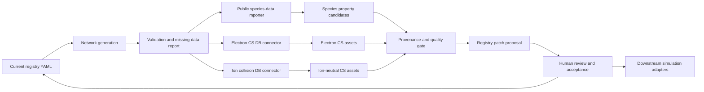

| 拡張部 | 入力 | 出力 | 人の判断が必要な点 |
|---|---|---|---|
| Public species-data importer | species id, composition, charge | mass, enthalpy, IE, EA, polarizability 候補 | 同名異性体、状態、単位、推奨値の選択 |
| Electron CS DB connector | electron pair, reaction type, target species | cross-section table asset と metadata | channel 対応、threshold 整合、重複データの選択 |
| Ion collision DB connector | ion-neutral pair, dnt_class | measured or model cross section asset | 実測/モデル値の採否、エネルギー範囲 |
| State registration feedback | cross-section product labels | 未登録 species template | fragment 表記、電荷、組成の確定 |
| Provenance gate | importer outputs | registry patch candidate | source、version、uncertainty、status の承認 |
| Downstream adapters | generated network and assets | BOLSIG+, PIC-MCC, fluid model, DNT input | 対象コードごとの単位・形式変換 |

### 拡張項目と優先度

| 拡張項目 | 内容 | 優先度 | 期待効果 |
|---|---|---:|---|
| 登録状態データの公開データでの自動取得 | NIST Chemistry WebBook、NIST ASD、CCCBDB 等から mass、enthalpy、IE、EA、polarizability を取得 | 高 | species YAML 登録の再現性向上 |
| 電子衝突反応断面積 DB 連携 | LXCat、Phelps、Bordage、文献データを asset として import | 高 | `data.cross_section.path` warning の解消 |
| イオン衝突断面積 DB 連携 | ion mobility、charge-transfer、detachment、DNT 関連データセットを登録 | 中 | DNT task から数値断面積生成への接続 |
| 反応断面積から状態種の登録 | cross-section product channel から未登録 species template を生成 | 中 | fragment 種の登録漏れ検出 |
| provenance 管理 | source、version、取得日、単位変換履歴を metadata に保存 | 高 | 論文・DB 更新時の追跡性向上 |
| 単位変換と uncertainty | kJ/mol、eV、amu、A3、D 等の変換と不確かさを明示 | 中 | 物理量の比較可能性向上 |
| 品質フラグと CI 検証 | curated/estimated/draft/deprecated の運用規則を CI で検査 | 高 | 不完全データの混入防止 |
| downstream adapter | DNT+/DNT+DM、BOLSIG+、fluid/PIC-MCC 入力形式への変換 | 中 | 生成ネットワークの利用範囲拡大 |

将来像のワークフローで重要なのは、自動取得を完全自動承認にしないことである。公開 DB から得られる値にも、状態、温度、単位、測定法、推奨値の違いが存在する。したがって、自動 importer は registry を直接上書きするのではなく、provenance 付きの patch proposal を生成し、人が承認する設計が望ましい。この設計により、データ取得の効率化と研究者による物理的判断を両立できる。

## 6.まとめ

`plasma-reactgen` は、低圧プラズマ反応ネットワークを登録データから再現可能に生成するためのファイル registry 型ツールである。Ar/CF4 テストケースでは、入力ガス Ar と CF4 から 12 状態種、42 反応、12 DNT task を生成し、全反応で species 参照、電荷収支、元素収支が成立することを確認した。

本コードの特徴は、反応リスト生成だけでなく、state role、DNT readiness、coverage、missing data、可視化までを一体として出力する点にある。これにより、プラズマ物理学者は、反応機構がどの登録データに基づくか、どの候補 pair が未登録か、どの物性値や断面積 table が未導入かを、解析初期段階で明示的に把握できる。

一方で、現段階では数値 electron/ion cross-section curve の import、DNT+/DNT+DM 断面積計算、公開 DB からの自動取得は未実装である。したがって本コードは、反応ネットワークとデータ準備状態を整理する基盤として位置付けられる。今後、公開データ取得、断面積 DB 連携、provenance 管理を追加することで、プラズマ反応機構構築の再現性、拡張性、監査可能性をさらに高められる。

## 参考文献

[1] NIST Chemistry WebBook, NIST Standard Reference Database 69. https://webbook.nist.gov/  
[2] NIST Atomic Spectra Database, NIST Standard Reference Database 78. https://www.nist.gov/pml/atomic-spectra-database  
[3] NIST Computational Chemistry Comparison and Benchmark Database, NIST Standard Reference Database 101. https://cccbdb.nist.gov/  
[4] LXCat, electron and ion scattering cross-section data portal. https://us.lxcat.net/  
[5] T. Nakano and H. Sugai, "Partial Cross Sections for Electron Impact Dissociation of CF4 into Neutral Radicals," Japanese Journal of Applied Physics 31, 2919 (1992). https://doi.org/10.1143/JJAP.31.2919  
[6] C. Ma, M. R. Bruce, and R. A. Bonham, "Absolute partial and total electron-impact-ionization cross sections for CF4 from threshold up to 500 eV," Physical Review A 44, 2921 (1991). https://doi.org/10.1103/PhysRevA.44.2921  
[7] B. L. Peko, S. V. Dyakov, R. L. Champion, M. V. V. S. Rao, and J. K. Olthoff, "Ion-Molecule Reactions and Ion Energies in CF4 Discharges," Physical Review E (1999). https://www.nist.gov/publications/ion-molecule-reactions-and-ion-energies-cf4-discharges  
[8] K. Denpoh and K. Nanbu, "Comprehensive ion-molecule reactive collision model for processing plasmas," Journal of Vacuum Science & Technology A 40, 063007 (2022). https://doi.org/10.1116/6.0002098  
[9] J. K. Olthoff et al., "Electron Interactions with CF4," NIST/J. Phys. Chem. Ref. Data reprint. https://srd.nist.gov/jpcrdreprint/1.555986.pdf  
