# plasma-reactgen 技術レポート

## ガス入力から追跡可能な多段反応リストを構築するregistry-driven手法

### 対象読者と本書の位置づけ

本書は、低温・低圧プラズマを扱う物理学者、反応機構をシミュレーションへ接続するエンジニア、反応・物性データを保守する担当者を対象とする。

本システムの主成果物は、プラズマ状態そのものの数値解ではなく、入力ガスから到達可能な登録済み反応を多段に展開した**反応リスト**である。反応リストには反応経路、利用可能な断面積・速度係数・移動度データ、DNT関連物性、出典および不足データが付随する。

> 重要: `plasma-reactgen`はBoltzmann solver、plasma solver、DNT+を実行しない。生成された反応リストとデータ充足状況を、後段のモデル構築・データレビューへ渡すためのシステムである。

### 本書の読み方

| 読者 | 先に読む箇所 | 確認できること |
|---|---|---|
| 反応リストを利用する人 | 3章、5.1～5.3節、8章 | gas入力から得られる反応式、深さ、前段反応、ベンチマーク結果 |
| 物理モデルを検討する人 | 3章、5.4～5.5節、6.7節 | 保存則、反応エネルギー、しきい値、DNT+入力の充足状態 |
| データを保守する人 | 5.6節、7章 | 外部データの取得、手動登録、レビュー、registry pack化 |
| コードを保守する人 | 6.1～6.6節、9章 | 各層の責務、決定論性、拡張時に守る境界 |

文中の英字は、`reaction_id`や`prepared_registry`など実際のファイル・コードで使う識別子に限って残している。一般概念は可能な限り日本語で説明し、初出時に対応する識別子を併記する。

---

## 1. 背景

低温プラズマでは、電子衝突、イオン–中性衝突、中性種間反応、イオン再結合などが相互に生成物を供給し、反応機構が多段化する。たとえば入力ガス $AB$ に対して、

$$
e + AB \rightarrow e + A + B
$$

で生成した $A$ が別の入力ガスまたは生成種 $BC$ と反応し、

$$
A + BC \rightarrow AB + C
$$

を生じる。さらに $C$ が電子衝突のtargetとなれば、反応ネットワークは次のdepthへ展開する。

反応式の存在だけでは定量モデルには不十分である。電子衝突断面積 $\sigma(E)$、速度係数 $k(T)$、反応しきい値、反応エネルギー、イオン–中性輸送に必要な物性を反応へ関連付ける必要がある。電子エネルギー分布 $f_E(E)$ が既知の場合、速度係数は一般に

$$
k = \int_0^\infty \sigma(E)\,v(E)\,f_E(E)\,dE
$$

と関係するが、本システムはこの積分を実行せず、$\sigma(E)$や既存の$k$候補をcatalog化する。

電子衝突データの代表的な公開基盤であるLXCatは、低温プラズマモデリング向けにpartial/complete cross-section setを提供する。一方、データセット選択やprocess同定は物理的判断を伴うため、単なる自動取得だけで信頼できる機構になるわけではない。[Pitchford et al., 2017](https://doi.org/10.1002/ppap.201600098)

熱化学量、イオン化エネルギー、電子親和力などは反応エネルギー評価に必要である。NIST Chemistry WebBookは熱化学、reaction thermochemistry、ion energeticsを収録するが、species同定、値の状態、測定法、出典の確認が必要である。[NIST Chemistry WebBook](https://webbook.nist.gov/)

---

## 2. 従来の課題

### 2.1 反応familyごとの手動選択

従来の単純な実装では、electron、ion-neutralなどの組合せをユーザー設定から個別に有効化し、全species組合せを生成しがちであった。この方法には次の問題がある。

- ユーザーが内部の反応family構成を知る必要がある。
- registryに存在しない組合せまで探索候補になる。
- species数に対して候補pair数が二次的に増加する。
- 新しいfamilyを追加するたびにCaseConfigと分岐処理が増える。

### 2.2 多段反応の由来が失われる

反応式だけを平坦に出力すると、ある後段反応がどの生成物によって有効になったかを判断できない。反応数が増えるほど、機構レビュー時に次の問いへ答えにくくなる。

- この反応は入力ガスから直接起こるのか。
- どの前段反応がreactantを生成したのか。
- 同じ反応へ複数経路から到達できるのか。
- 反応展開がcycleや非決定的順序を含んでいないか。

### 2.3 反応と数値データが一対一で扱われる

同じreaction channelに対して複数の断面積、温度範囲の異なる速度係数、実験値と評価値が併存し得る。一件の`cross_section`だけを保持する形式では、候補比較、validity、preferred指定、出典保持が難しい。

### 2.4 データ不足が生成処理を止める、または隠れる

反応定義はあるが数値データがない場合、反応自体を消すと機構の構造を過小評価する。逆に不足を隠して出力すると、後段の定量計算で暗黙の欠損になる。

### 2.5 データ取得と通常生成の混在

外部API、raw file変換、registry更新を`generate`へ混ぜると、ネットワークアクセス、外部サービスの状態、ライセンス、取得時刻が生成結果へ影響する。再現可能性とレビュー境界が失われる。

---

## 3. 課題に対する本手法の概要

本手法は、ローカルregistryを反応定義のsource of truthとし、frontier方式で到達可能な二体反応だけを展開する。

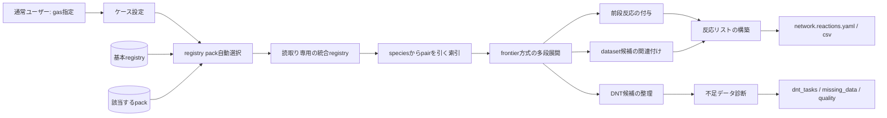

### 3.1 Frontier展開

depth $d$ におけるactive species集合を $A_d$、新規frontierを $F_d$、registry登録pair集合を $\mathcal{P}$ とする。探索対象pairは

$$
\mathcal{P}_d = \left\{p \in \mathcal{P}\;\middle|\;R(p) \subseteq A_d,\;R(p)\cap F_d \neq \varnothing\right\}
$$

である。ここで $R(p)$ はpairのreactant species集合である。選択したpairの登録channelから生成される新規species集合を $G_d$ とすると、

$$
A_{d+1}=A_d\cup G_d, \qquad F_{d+1}=G_d\setminus A_d
$$

となる。registryに存在しないpairをCartesian productから推測しないため、探索範囲と反応定義の責任が明確になる。

### 3.2 Lineage

反応 $r$ の非入力reactantを生成できる、より浅いdepthの反応集合を

$$
\operatorname{Prec}(r)=\left\{q\;\middle|\;\operatorname{depth}(q)<\operatorname{depth}(r),\;P(q)\cap R_{\mathrm{noninput}}(r)\neq\varnothing\right\}
$$

とし、`precursor_reaction_ids`へ格納する。参照方向を必ず浅いdepthへ制限するため、lineage graphはcycleを作らない。

### 3.3 保存則検証

各species $s$ の元素 $a$ の組成数を $N_{s,a}$、電荷を $q_s$、化学量論係数を $\nu_s$とする。反応ごとに

$$
\sum_{s\in products}\nu_s N_{s,a}-\sum_{s\in reactants}\nu_s N_{s,a}=0
$$

$$
\sum_{s\in products}\nu_s q_s-\sum_{s\in reactants}\nu_s q_s=0
$$

を検査し、`validation.element_balance`と`validation.charge_balance`へ出力する。

### 3.4 Dataset catalog

一反応に複数の`ReactionDataset`を保持する。主要なkindは次の通りである。

| kind | 物理的意味 | 主なrepresentation |
|---|---|---|
| `cross_section` | $\sigma(E)$ | table, reference_only |
| `rate_coefficient` | $k(T)$ または定数$k$ | table, constant, arrhenius, kooij |
| `mobility` | ion/electron mobility | table, constant |
| `branching_fraction` | product分岐率 | table, constant |
| `threshold` | reaction threshold | constant, reference_only |
| `reaction_energy` | $\Delta E$ | constant, reference_only |

Arrhenius/Kooij型の例は

$$
k(T)=A\left(\frac{T}{T_0}\right)^n\exp\left(-\frac{E_a}{k_B T}\right)
$$

である。representation、parameter、温度範囲、単位、sourceを保持するが、core generateは式の評価や単位推定を行わない。

---

## 4. 課題に対する本手法の効果

| 課題 | 本手法 | 効果 |
|---|---|---|
| familyごとの設定増加 | registry indexから自動探索 | 通常ユーザーはgasだけを指定 |
| 未登録pairの総当たり | activeかつfrontier関与pairだけ選択 | 不要な候補と計算量を抑制 |
| 後段反応の由来不明 | precursor reaction IDを付与 | 反応経路を追跡可能 |
| datasetの上書き | datasetをlistとして保持 | 複数候補、validity、出典を比較可能 |
| 不足データで生成停止 | 反応を残してmissing-data化 | 機構構造とデータ充足を分離 |
| 外部取得による非再現性 | generateはlocal/read-only | 同一入力とregistryから決定論的出力 |
| 出力契約の意図しない拡張 | 明示的serializer | internal model変更とpublic contractを分離 |
| 限界超過が見えない | truncationをmachine-readable出力 | 不完全な生成をcompleteと誤認しない |

本手法は「反応が登録されているか」「数値データがあるか」「DNTへ渡せるか」を別の軸で表現する。この分離により、データが不足している機構もレビュー対象として保持できる。

---

## 5. 本手法の入出力、必要データ、利用方法

### 5.1 通常ユーザーの入力

最小の操作はcase YAMLとgenerateだけである。

```yaml
schema_version: 1
case:
  name: ar_cf4_example
gases:
  - Ar
  - CF4
expansion:
  max_depth: 3
```

```powershell
reactgen generate case.yaml --output outputs
```

`--registry`を省略すると、入力gasをすべて含むversion付きregistry packを自動選択する。該当packがなければbase registryで継続し、coverage gapを診断する。通常ユーザーへsource profile、workspace、mapping、物性入力を要求しない。

### 5.2 主な出力

| ファイル | 用途 | 主な読者 |
|---|---|---|
| `network.reactions.yaml` | 機械可読な主反応リスト | simulator、データ処理 |
| `network.reactions.csv` | 表計算・フィルタ用反応リスト | 物理・反応レビュー |
| `network.states.yaml/csv` | 到達speciesとdepth | 機構レビュー |
| `dnt_tasks.yaml` | ion-neutral pair、物性、dataset、readiness | 輸送・DNT担当 |
| `missing_data.yaml/csv` | 不足フィールドと検索key | データ保守担当 |
| `coverage_report.yaml` | pair探索とcoverage | 開発・品質保証 |
| `summary.json` | 件数、完了性、truncation、pack | 自動化・CI |
| `quality_summary.yaml` | readinessと警告 | リリースレビュー |
| `visualizations/network/species_lineage.svg` | speciesの生成深さと接続関係 | 機構の俯瞰 |
| `visualizations/network/reaction_equation_network.svg` | 反応式と前段反応の到達関係 | 反応経路レビュー |

### 5.3 反応レコード

```yaml
- id: e_CF4_dissociation_CF3_F
  equation: e + CF4 -> e + CF3 + F
  family: electron
  type: dissociation
  depth: 0
  reactants:
    - species: e
      n: 1
    - species: CF4
      n: 1
  products:
    - species: e
      n: 1
    - species: CF3
      n: 1
    - species: F
      n: 1
  precursor_reaction_ids: []
  available_data:
    cross_sections: []
    rate_coefficients: []
    mobility: []
  threshold_eV: null
  deltaE_products_minus_reactants_eV: null
  provenance_summary: {}
  validation:
    charge_balance: ok
    element_balance: ok
```

### 5.4 必要なregistryデータ

#### Species

| 項目 | 必須度 | 用途 |
|---|---|---|
| `id` | 必須 | 一意参照 |
| `composition` | 必須 | 元素収支、質量計算 |
| `charge` | 必須 | 電荷収支、species class |
| `classes` | 必須 | neutral/ion/radical分類 |
| `mass_amu` | 推奨 | DNT、輸送。組成から計算可能 |
| `enthalpy_formation_eV` | 推奨 | $\Delta E$評価 |
| `ionization_energy_eV` | 推奨 | ionization/charge transfer評価 |
| `electron_affinity_eV` | 推奨 | attachment/negative ion評価 |
| `polarizability_A3` | DNT neutralで必須 | ion-induced dipole相互作用 |
| `dipole_moment_D` | DNT neutralで必須 | DNT+ / DNT+DM分類 |
| `collision_radius_A` | DNT neutralで必須 | short-range collision model |

組成からの質量は、元素 $i$ の標準原子量 $A_i$を用いて

$$
m_s=\sum_i N_{s,i}A_i
$$

と計算する。標準原子量はIUPAC/CIAAWの評価値に基づくべきである。[IUPAC Periodic Table](https://iupac.org/what-we-do/periodic-table-of-elements/)

#### Reaction pair/channel

```yaml
pair:
  family: ion_neutral
  projectile: Ar+
  target: CF4
channels:
  - id: Arp_CF4_charge_transfer
    type: charge_transfer
    products:
      - species: Ar
        n: 1
      - species: CF4+
        n: 1
    threshold_eV: null
    deltaE_products_minus_reactants_eV: null
    status: curated
    datasets: []
```

反応エネルギーを生成物–反応物の規約で表す場合、

$$
\Delta E_{p-r}=\sum_{p}\nu_p H_p-\sum_r\nu_r H_r
$$

である。符号規約はdataset/sourceとともに明示する。

### 5.5 DNT候補の読み方

ion質量 $m_i$、neutral質量 $m_n$から換算質量を

$$
\mu=\frac{m_i m_n}{m_i+m_n}
$$

として出力する。DNT+担当者が最初に確認するファイルは`dnt_tasks.yaml`である。イオン–中性ペアごとに、次の情報が一つのレコードへまとまる。

| 項目 | 出力内容 | DNT+での用途 |
|---|---|---|
| `pair_id`, `ion`, `neutral` | ペア識別子と構成種 | 計算ケースの識別 |
| `reaction_ids` | 当該ペアに関係する反応ID | 反応リストとの照合 |
| `required_properties.ion` | `mass_amu`, `charge`の値、単位、出典、充足状態 | イオン側入力 |
| `required_properties.neutral` | `mass_amu`, `polarizability_A3`, `dipole_moment_D`, `collision_radius_A`の値、単位、出典、充足状態 | 中性側入力 |
| `existing_datasets` | 断面積、速度係数、移動度のdataset ID | 既存データの優先利用判断 |
| `channels` | 反応ID、生成物、threshold、反応エネルギー、出典 | チャネル別計算条件 |
| `pair_property_readiness` | ペア物性だけの充足判定 | DNT+入力作成の可否 |
| `complete_readiness` | ペア物性とチャネル情報を合わせた判定 | 定量利用前の警告確認 |
| `data_choice.status` | 既存データとDNT+計算のどちらを優先するか | 作業の振り分け |

質量がspeciesレコードになくても組成から計算できる場合は自動補完される。したがって、通常ユーザーがDNT+用の物性ファイルを別途入力する必要はない。不足値は空欄にせず、値を`null`、状態を`missing`として明示する。

出力レコードは概略として次の形になる。実際のファイルでは各物性に`source_record`と充足状態が付き、`channels`は該当反応の数だけ並ぶ。

```yaml
- pair_id: Ar+__Ar
  ion: Ar+
  neutral: Ar
  required_properties:
    ion:
      mass_amu: {value: 39.94745, unit: amu, source: "...", available: true}
      charge: {value: 1, unit: e, source: species, available: true}
    neutral:
      mass_amu: {value: 39.948, unit: amu, source: "...", available: true}
      polarizability_A3: {value: 1.6411, unit: A3, source: "...", available: true}
      dipole_moment_D: {value: 0.0, unit: D, source: atomic_symmetry, available: true}
      collision_radius_A: {value: 1.7025, unit: A, source: "...", available: true}
  reaction_ids: [Arp_Ar_elastic, Arp_Ar_resonant_charge_exchange]
  existing_datasets:
    cross_sections: []
    rate_coefficients: []
    mobility: []
  channels:
    - reaction_id: Arp_Ar_elastic
      type: elastic
      threshold_eV: null
      deltaE_products_minus_reactants_eV: 0.0
  data_choice: {status: dnt_properties_ready}
```

`data_choice.status`の読み方は次の通りである。

| 状態 | 推奨する扱い |
|---|---|
| `existing_cross_section_available` | 登録済み断面積を確認し、適用範囲と出典が適切なら優先する |
| `existing_rate_coefficient_available` | 登録済み速度係数を確認し、温度範囲と単位が適切なら優先する |
| `dnt_properties_ready` | 既存datasetはないが必要物性は揃っており、DNT+計算候補とする |
| `missing_dnt_properties` | 表示された不足物性を補ってからDNT+へ渡す |
| `no_reaction_channel` | registryに対応チャネルがなく、反応定義の確認を先に行う |

`pair_property_readiness`はペア物性だけ、`complete_readiness`はchannel thresholdとreaction energyを含む完全性を表す。

| status | 意味 |
|---|---|
| `ready` | 必須物性とchannel dataが揃う |
| `ready_with_warnings` | pair物性は揃うがchannel値が不足 |
| `missing_required_data` | ion/neutral必須物性が不足 |
| `no_dnt_channels` | DNT対象channelなし |

実務上は、(1) `data_choice.status`でペアを仕分け、(2) `existing_datasets`の適用範囲と出典を確認し、(3) DNT+計算候補では`required_properties`を入力へ転記し、(4) `channels`のthresholdと反応エネルギーを確認する。必要に応じて既存互換の`dnt_inputs/<pair_id>.yaml`も利用できる。本コードが行うのは候補と入力情報の整理までであり、DNT+の実行と計算結果の取込みは行わない。

### 5.6 データ登録担当者の利用方法

本コードは、担当者が数値を推測して直接書き込む運用を前提としていない。公開データベース、組織内スナップショット、原論文から取得した記録を、出典と原本hashを付けて一度準備し、レビュー済みregistry packとして利用者へ配布する。

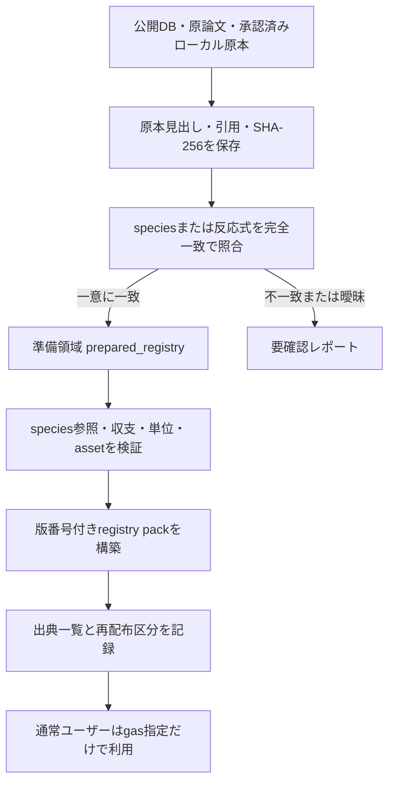

#### 参照元と扱う情報

参照元の利用条件は[`external_data/source_catalog.yaml`](../external_data/source_catalog.yaml)に集約されている。これは取得先の一覧だけでなく、通常生成での利用可否、ライセンス確認の要否、再配布リスクを記録する管理台帳である。

| 情報 | 主な参照元 | 本コードでの扱い |
|---|---|---|
| 化学式、組成、別名、外部ID | local registry、組織内台帳、PubChem・ChEBI等から作成したidentity snapshot | species候補を照合し、人手確認後に登録 |
| 質量 | 登録組成とIUPAC標準原子量 | 組成から自動計算可能 |
| 生成エンタルピー、電離エネルギー、電子親和力 | NIST Chemistry WebBook、ATcT系の承認済みlocal snapshot | 値、単位、引用、評価区分を保持 |
| 電子衝突断面積 | 利用者が取得したLXCat local export、承認済みCSV/TSV | process blockを分離し、完全一致した反応だけへ関連付け |
| イオン–中性反応と速度係数 | review済み反応表・原論文、KIDA/UMIST変換データは候補探索 | 半導体プラズマへの妥当性を確認してから昇格 |
| 分極率、双極子モーメント、衝突半径 | curated property snapshot、組織内評価値、NIST等の引用記録 | DNT必須物性として値・単位・出典・状態を保持 |
| 原子衝突データ | OpenADAS原本 | 現状は原本登録とmapping候補まで。ADF全面変換は未対応 |
| 分光・原子分子データ | VAMDCのTAP/XSAMS取得結果 | raw queryと応答を保存。nodeごとの差はレビュー対象 |
| 商用・利用制限付きデータ | 利用者が適法に取得したexport | 自動取得せず、組織内利用・site-local等の再配布区分を保持 |

PubChemは物質同定、LXCatは電子衝突断面積、NIST/ATcT系は熱化学・基礎物性というように役割を分ける。データベース名だけを出典とせず、各datasetまたは物性に`source_record`、citation、source ID、原本header、SHA-256、取得元path、状態を残す。これにより、数値が「どこから来たか」と「どの反応へ適用されたか」をreaction IDから追跡できる。

自動照合は化学種または反応式が一意に完全一致した場合に限る。表記揺れ、生成物不明、複数候補は`review report`へ送り、自動適用しない。また、LXCat等の数値assetは利用条件を確認し、`permitted`、`internal`、`site-local`を区別する。公開packへ無条件に同梱しない。

代表的な保守コマンドは次の通りである。

```powershell
python -m external_data_tools.data_admin plan_registry_pack `
  --seed-gases Ar CF4 --max-depth 3 --registry registry

python -m external_data_tools.data_admin import_lxcat_raw export.txt `
  --registry workspace/prepared_registry

python -m external_data_tools.data_admin import_property_snapshot properties.yaml `
  --registry workspace/prepared_registry

python -m external_data_tools.data_admin import_rate_snapshot rates.yaml `
  --registry workspace/prepared_registry

python -m external_data_tools.data_admin build_registry_pack `
  --id ar_cf4 --version 1.0.0 --seed-gases Ar CF4 `
  --max-depth 3 --registry workspace/prepared_registry
```

raw dataはsource header、citation、hash、redistribution statusを保持する。exact match以外は自動適用せず、ambiguous mappingをreviewへ送る。

---

## 6. 本手法の構成、処理ワークフロー、アーキテクト観点の設計

### 6.1 レイヤ構造

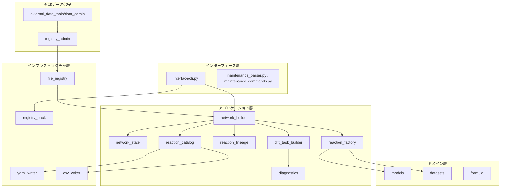

### 6.2 各処理の責務

| 処理 | 責務 | 意図的に行わないこと |
|---|---|---|
| `FileRegistry` | indexed species/channel読込み、rule・asset参照 | 外部取得、registry自動書換え |
| `registry_index` | registry YAML読込み、ID重複検査、species-to-pair index構築 | domain判定、外部取得 |
| `registry_pack` | gasに基づくpack選択とread-only overlay | userへpack選択を要求 |
| `network_builder` | frontier反復とlimit適用 | serializer、外部API、solver実行 |
| `network_state` | active/frontier/species node管理 | reaction data解釈 |
| `reaction_factory` | channel検証とGeneratedReaction化 | 出力契約の暗黙決定 |
| `reaction_lineage` | precursor/path構築 | same-depth/cyclic edge |
| `reaction_catalog` | public reaction recordを明示構築 | dataclass全fieldの自動公開 |
| `dnt_task_builder` | pair物性、dataset、readiness整理 | DNT計算・結果取込み |
| `diagnostics` | network由来の不足データ作成 | 独立した反応再探索 |
| writer | 決定論的serialization | domain判断 |
| `visualization/reaction_pathway_layout` | depth別のcard配置、canvas寸法 | SVG表現、経路探索 |
| `visualization/reaction_pathway` | 反応式nodeとprecursor edgeのSVG表現・保存 | layout計算、経路探索、反応の推定 |
| `external_data_tools` | raw/snapshot import、pack build | core generateへの依存追加 |

### 6.3 一連の処理

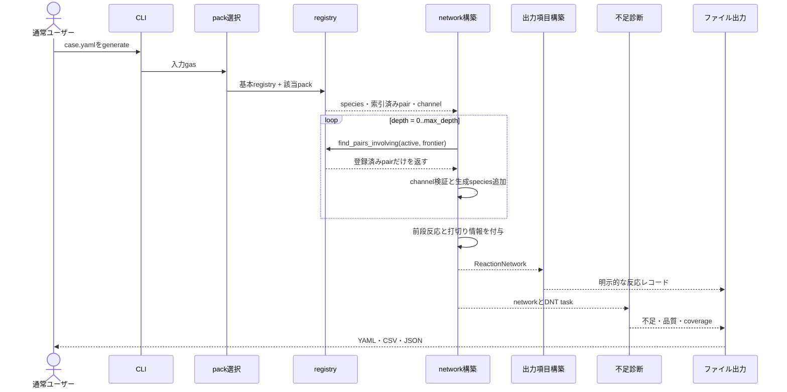

### 6.4 決定論性

決定論性は次の規則で確保する。

- registry file、pair、channel、species IDを安定sortする。
- 同一pairをkeyでdeduplicateする。
- lineageは短いpathを優先し、同順位はID順にする。
- dataset listとprecursor listを安定sortする。
- 外部APIや現在時刻をcore outputへ混入させない。
- configured limit到達時は黙って切らず、`truncations`へ記録する。

### 6.5 読取り専用境界とpromotion

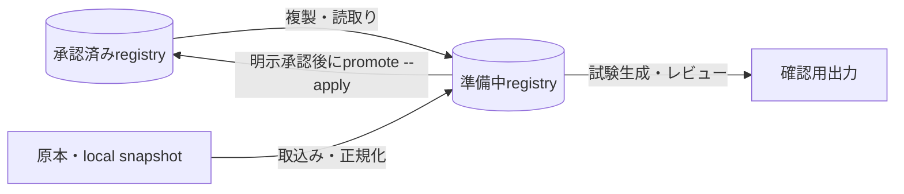

通常生成はcurated registryまたはversioned packを変更しない。imported/estimated dataはreviewなしにcuratedへ昇格しない。

### 6.6 二つのネットワーク図の使い分け

speciesをnodeとする従来図は、生成種の次数、接続の集中、到達depthを把握しやすい。一方、一つの辺がどの化学反応式に対応するかは読み取りにくい。そこで、同じ`network.reactions.yaml`から反応式をnodeとする`reaction_equation_network.svg`も生成する。

| 図 | node | edge | 適した確認 |
|---|---|---|---|
| `species_lineage.svg` / `reaction_network.svg` | species | 反応によるspecies間接続 | 生成種、次数、ネットワーク全体の広がり |
| `reaction_equation_network.svg` | 反応式 | `precursor_reaction_ids`による前段–後段関係 | 化学反応式、多段経路、反応family、depth |

反応式図はdepthごとに列を分け、枠内へreaction ID、化学反応式、反応分類を表示する。矢印は「前段反応の生成speciesが後段反応の反応物として使われた」関係であり、反応速度や流束の大小ではない。色は電子衝突、イオン–中性、中性–中性、イオン–イオン、電子–イオンのfamilyを表す。したがって、species図で全体形状を把握した後、反応式図で経路の物理的意味を確認するのがよい。

### 6.7 反応リスト生成の数理と判定手順

#### 6.7.1 反応の表現

反応 $r$ を、化学種 $X_s$ と化学量論係数 $\nu_{s,r}^{-}$、$\nu_{s,r}^{+}$を用いて

$$
\sum_s \nu_{s,r}^{-}X_s \rightarrow \sum_s \nu_{s,r}^{+}X_s
$$

と表す。上付き$-$は反応物側、$+$は生成物側を表す。本コードではpairの`projectile`と`target`が反応物を構成し、channelの`products`が生成物を構成する。係数は`n`として保持され、人間可読な`equation`はこの構造から生成される。反応式文字列を再解釈して計算する設計ではない。

#### 6.7.2 registry indexによるpair選択

registry読込み時に、化学種$s$を反応物に含む登録pair key集合$I(s)$を作る。depth $d$で調べる候補集合は

$$
\widetilde{\mathcal P}_d=\bigcup_{s\in F_d}I(s)
$$

であり、そのうち二つの反応物がともにactiveであるpairだけを残す。

$$
\mathcal P_d=left\{p\in\widetilde{\mathcal P}_d\;\middle|\;
\operatorname{projectile}(p)\in A_d,\;
\operatorname{target}(p)\in A_d
\right\}
$$

この式は「少なくとも一方がfrontier」「両方がactive」という二条件を同時に表す。$A_d\times A_d$を総当たりしないため、登録されていない組合せを通常反応として生成しない。pair keyで重複を除き、key順にsortしてから上限`max_pairs_per_depth`を適用する。

#### 6.7.3 channel採用判定

pair $p$に登録されたchannel集合を$C(p)$とする。channel $c$が反応リストへ入るための論理条件は、概念的には

$$
\operatorname{eligible}(c)=
S(c)\land I(c)\land D(c)\land V(c)
$$

である。

| 条件 | 内容 |
|---|---|
| $S(c)$ | `status`が`data_policy.allowed_status`に含まれる |
| $I(c)$ | inferredの場合、inferenceが明示的に有効で、confidenceが下限以上である |
| $D(c)$ | strictなdata policyを指定した場合、電子断面積またはDNT物性が利用可能である |
| $V(c)$ | species参照と保存則が許容される |

デフォルトでは`include_reactions_without_cross_section`と`include_reactions_without_dnt_ready_properties`が真である。このため、数値データ不足だけを理由に登録反応式を消さない。断面積が「利用可能」と判定されるのは、datasetまたは後方互換の`data.cross_section`が実在するローカルassetを指す場合である。文献参照だけ、または存在しないpathは反応定義の保持には使えるが、利用可能な断面積とは数えない。

#### 6.7.4 species参照、電荷収支、元素収支

化学種$s$の電荷数を$z_s$、元素$a$の原子数を$N_{s,a}$とする。電荷収支残差と元素収支残差は

$$
\varepsilon_q(r)=
\sum_s\nu_{s,r}^{+}z_s-
\sum_s\nu_{s,r}^{-}z_s
$$

$$
\varepsilon_a(r)=
\sum_s\nu_{s,r}^{+}N_{s,a}-
\sum_s\nu_{s,r}^{-}N_{s,a}
$$

である。全ての$a$について$|\varepsilon_a|\le 10^{-12}$かつ$|\varepsilon_q|\le 10^{-12}$なら保存則を満たす。電子は元素組成を持たず、電荷$-1$として扱う。未知speciesがある場合は`unknown_species`、収支が合わない場合は`failed`となる。`failed`反応は常に拒否し、不明項目を含む反応は`include_incomplete_reactions`が真の場合だけ残す。

#### 6.7.5 frontier更新とdepth

channel $c$の生成物集合を$P(c)$、既出のspecies node集合を$N_d$とすると、新しく導入される候補は

$$
G_d=\bigcup_{c\in C_d}\left(P(c)\setminus N_d\right)
$$

である。ただし電子、未登録species、伝播対象classに含まれないspecies、設定上除外された励起種は次のfrontierへ入らない。採用された新規speciesを$G_d^{\ast}$とすれば、

$$
A_{d+1}=A_d\cup G_d^{\ast},\qquad
F_{d+1}=G_d^{\ast}
$$

となる。入力gasの`depth_first_seen`は0、depth $d$の反応で初めて生成したspeciesは$d+1$である。反応そのものの`depth`は、そのpairがfrontier条件を初めて満たした$d$である。$F_{d+1}=\varnothing$、`max_depth`到達、またはいずれかの安全上限到達で展開を終了する。

#### 6.7.6 前段反応の決定

species$s$を生成し、かつ反応物側に同じ$s$を含まない反応の集合をproducer集合$Q(s)$とする。反応$r$の入力gas以外の反応物集合を$R_{\mathrm{noninput}}(r)$とすると、

$$
\operatorname{Prec}(r)=
\bigcup_{s\in R_{\mathrm{noninput}}(r)}
\left\{q\in Q(s)\mid d(q)<d(r)\right\}
$$

を`precursor_reaction_ids`へ格納する。depthが小さい反応だけを参照するため、有向辺$q\rightarrow r$に沿ってdepthは必ず増加し、cycleは生じない。入力gasから直接起こるdepth 0反応では集合は空である。複数のproducerがある場合は全て保持し、`(depth, reaction ID)`順に並べる。

#### 6.7.7 反応エネルギー、しきい値、エントロピー

準備処理で反応に関与する全speciesの標準生成エンタルピー$\Delta_f H_s^\circ$が揃う場合、現在の反応エネルギー補完処理はイオン–中性channelについて

$$
\Delta H_r^\circ=
\sum_s\nu_{s,r}^{+}\Delta_f H_s^\circ-
\sum_s\nu_{s,r}^{-}\Delta_f H_s^\circ
$$

を計算し、`deltaE_products_minus_reactants_eV`へ格納する。既存値は上書きせず、使用したspeciesごとの`source_record`と符号規約を残す。フィールド名は`deltaE`だが、自動補完値の実体は登録された生成エンタルピーから求めた生成物–反応物差である。電子状態、振動状態、ゼロ点エネルギー等をどこまで含むかは参照元の定義に依存する。

`threshold_eV`はこの値と同一ではない。単純な吸熱反応でも運動学、内部状態、ポテンシャル障壁、電子衝突processの定義によって観測しきい値が変わるため、一般に

$$
E_{\mathrm{th}}\neq \max(0,\Delta H_r^\circ)
$$

である。したがって、しきい値は原データまたは評価文献から独立に登録する。

現実装はエントロピーを反応判定へ使っていない。標準反応エントロピーとGibbs自由エネルギーを扱うなら、

$$
\Delta S_r^\circ(T)=
\sum_s\nu_{s,r}^{+}S_s^\circ(T)-
\sum_s\nu_{s,r}^{-}S_s^\circ(T)
$$

$$
\Delta G_r^\circ(T)=\Delta H_r^\circ(T)-T\Delta S_r^\circ(T)
$$

$$
K^\circ(T)=\exp\left[-\frac{\Delta G_r^\circ(T)}{RT}\right]
$$

が必要になる。しかし、registryには標準モルエントロピー、熱容量、分配関数、標準状態が系統的に登録されていない。また、非平衡プラズマでは$\Delta G^\circ$の符号だけで電子衝突反応や反応速度を採否できない。このため現在は、エントロピーや平衡定数から反応を追加・削除せず、登録反応、保存則、データpolicyだけでリストを構築する。将来導入する場合も、熱力学的整合性診断または逆反応速度の補助情報として分離し、反応到達性と混同しない設計が適切である。

#### 6.7.8 上限と決定論性

計算量の上限は`max_species`、`max_reactions`、`max_pairs_per_depth`、`max_missing_pairs_per_depth`で制御する。上限到達は正常完了として隠さず、

$$
N_{\mathrm{omitted}}=N_{\mathrm{observed}}-N_{\mathrm{retained}}
$$

を可能な範囲で`truncations`へ記録する。pair、channel、dataset、precursorを安定sortし、外部取得や時刻を生成処理から排除することで、同じcaseとregistryから同じ順序の反応リストを得る。

---

## 7. 外部データ取得・登録・レビュー

### 7.1 自動取得機能は実装されているか

結論として、**限定された自動取得機能は実装済み**である。ただし`reactgen generate`が不足値を見つけて自動的にWeb検索する機能ではない。外部アクセスは`external_data_tools`を利用者またはデータ保守担当者が明示的に起動したときだけ行われ、取得結果はraw fileまたはsnapshotとして保存される。レビュー後にprepare/enrich、明示的promotion、registry pack構築を経て通常生成に使う。

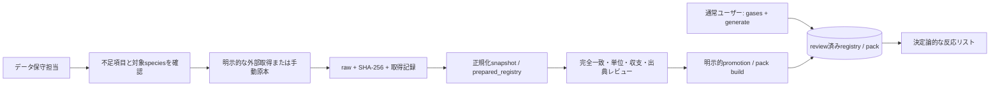

この分離により、通常ユーザーの操作は変わらず、ネットワーク障害や外部DBの更新によって同じ`generate`の結果が変わることもない。

### 7.2 実装状況一覧

| 参照元・機能 | 自動化の実装状況 | 取得・変換範囲 | 通常生成への入り方 |
|---|---|---|---|
| 明示URL download manifest | 実装済み | 利用者指定URLを取得し、SHA-256、取得日時、User-Agent、成否を記録 | rawを別のimporterで準備 |
| PubChem PUG REST | オンライン取得を実装済み | CID、分子式、分子量、SMILES、InChIKey、synonym。反応・断面積は対象外 | identity snapshotをreviewしてenrich |
| VAMDC TAP/XSAMS | 明示queryのオンライン取得を実装済み | 利用者指定endpoint/queryのraw応答とhashを保存 | 現状はraw capture。汎用XSAMS反応変換は未実装 |
| `chemicals` Python package | 明示install・local参照を実装済み | identity、質量、双極子、生成エンタルピー等の候補 | curated sourceより低い優先度でenrich |
| NIST | plan・local snapshot validationを実装済み | 必要物性の計画、承認済みYAML snapshotの検証 | snapshot providerからenrich。Web自動照会・scrapingなし |
| Argonne/ATcT系 | plan・local snapshot validationを実装済み | 熱化学snapshotと生成エンタルピーによる反応エネルギー補完 | prepared registryだけを更新。オンライン取得なし |
| LXCat | local raw parser/importerを実装済み | 利用者取得exportのprocess block分割、表の正規化、header・citation・hash保持 | 反応式の完全一致だけ自動link。login・crawler・自動downloadなし |
| OpenADAS | local raw登録を実装済み | 手動取得ADF01/ADF07原本のcache、hash、mapping表 | raw metadataと明示mappingまで。全面的ADF parserなし |
| ChEBI | local snapshot取込みを実装済み | identity record、alias、外部ID | snapshotをreviewしてenrich |
| ChemSpider、OPSIN、NCI/Cactus | provider骨格のみ | dry-runと未実装理由の報告 | オンライン取得は未実装 |
| KIDA/UMIST形式 | local変換を実装済み | 手元の反応表を候補datasetへ正規化 | 半導体プラズマ向け妥当性レビュー後に使用 |
| 商用DB/QDB export | 管理台帳のみ | 利用者が適法に用意した原本を想定 | 専用adapterは未実装 |

したがって「各種DBから不足データを完全自動補完する」段階ではない。実装済みなのは、明示的で監査可能な取得、原本cache、限定的な正規化、完全一致による関連付けである。データの科学的採否と利用条件の確認は自動化していない。

### 7.3 自動取得を使う場合

自動取得が適するのは、公開APIまたは取得可能な明示URLがあり、問い合わせ対象が事前に確定している場合である。最初にdry-runまたは設定確認を行う。

```powershell
# 外部接続policyと必要ファイルを確認
python -m external_data_tools.source_setup `
  --config external_data/source_access_profiles.yaml --check

# PubChemから物質同定snapshotを取得。species_listにはidとqueryを列挙する
python -m external_data_tools.pubchem_fetch species_list.yaml `
  --output-root external_data/raw/pubchem `
  --snapshot external_data/snapshots/pubchem_species.yaml --dry-run

python -m external_data_tools.pubchem_fetch species_list.yaml `
  --output-root external_data/raw/pubchem `
  --snapshot external_data/snapshots/pubchem_species.yaml

# 利用者が記述したURL manifestを取得
python -m external_data_tools.download_manifest downloads.yaml `
  --output-root external_data/raw --dry-run
python -m external_data_tools.download_manifest downloads.yaml `
  --output-root external_data/raw

# 利用者が指定したVAMDC TAP queryのraw応答を保存
python -m external_data_tools.vamdc_query vamdc_queries.yaml `
  --output-root external_data/raw/vamdc --dry-run
```

既定の`source_access_profiles.yaml`では`allow_network_downloads: false`であり、sourceも多くがdisabledである。設定確認だけではdownloadは始まらない。ネットワーク取得を行うには、利用条件を確認したうえで対象sourceとpolicyを明示的に有効化する必要がある。

### 7.4 手動で原本を登録する場合

手動登録が適するのは、loginが必要、利用規約上自動取得が不適切、論文付録や社内DBである、候補対応に専門判断が必要、といった場合である。これは数値をYAMLへ手入力するという意味ではなく、正規のexportまたはsnapshotを取得し、importerへ渡す運用である。

```powershell
# LXCatのlocal exportをprocessごとに解析してprepared registryへ登録
python -m external_data_tools.data_admin import_lxcat_raw lxcat_export.txt `
  --registry workspace/prepared_registry `
  --redistribution-status site-local

# 物性snapshotを正規化
python -m external_data_tools.data_admin import_property_snapshot properties.yaml `
  --registry workspace/prepared_registry

# 定数・表・Arrhenius形式の速度係数snapshotを正規化
python -m external_data_tools.data_admin import_rate_snapshot rates.yaml `
  --registry workspace/prepared_registry

# 手動取得したOpenADAS原本をcacheし、明示mappingを記録
python -m external_data_tools.openadas_raw_import openadas_manifest.yaml `
  --workspace workspace
```

importerは同一hashの再登録を避け、原本header、database、contributor、citation、SHA-256、元path、再配布区分を可能な範囲で保持する。LXCatやrate snapshotは反応式が一意に完全一致した場合だけ自動適用し、0件または複数一致はreview reportへ送る。

### 7.5 自動取得と手動登録の選択基準

| 状況 | 推奨経路 | 理由 |
|---|---|---|
| PubChemでformula・alias・identifierを確認する | PubChem自動取得 | APIと対象項目が明確でraw JSONも保存できる |
| LXCat断面積を使う | manual export + raw importer | login、process選択、citation、再配布判断が必要 |
| NIST/ATcTの熱化学値を使う | reviewed local snapshot | 状態、温度、単位、引用、符号規約の確認が必要 |
| VAMDCの既知nodeへ既知queryを投げる | 明示queryによるraw自動取得 | queryとendpointを記録できるが、意味解釈は後段reviewが必要 |
| 原論文の表、社内評価値を使う | property/rate snapshot import | 出典と評価区分を担当者が確定できる |
| 不足項目の参照先が分からない | `missing_data`とplanを先に確認 | 無差別なWeb検索や誤対応を避ける |

判断原則は、**取得を自動化できることと、登録を自動決定できることを分ける**ことである。raw取得は再現可能に自動化しても、species同定、反応channel対応、単位、温度範囲、励起状態、利用許諾に曖昧さがあればpromotionを止める。

### 7.6 取得後のレビューと通常利用

取得しただけではbase registryへ入らない。推奨手順は次の通りである。

1. raw fileと取得manifestのSHA-256、citation、license noteを確認する。
2. snapshot validatorまたはimport reportの`unresolved`と`ambiguous`を解消する。
3. `workspace/prepared_registry`でspecies参照、電荷・元素収支、dataset単位、asset存在を検証する。
4. prepared registryを明示指定して試験生成し、反応式、dataset、DNT物性、missing dataをレビューする。
5. `reactgen promote`のdry-runまたは`build_registry_pack`で差分を確認する。
6. 承認後だけ`--apply`またはversion付きpack配布を行う。

通常ユーザーは完成したpackを自動選択して`reactgen generate case.yaml --output outputs`を実行するだけでよい。外部取得設定やAPI、mappingを通常ユーザーへ要求しない。

---

## 8. ベンチマーク問題設定と結果

### 8.1 問題設定

solver精度ではなく、次を検証対象とした。

1. 入力gasから登録反応をdepth 3まで展開できるか。
2. electron、ion-neutral反応と生成speciesを保持できるか。
3. lineageが浅いdepthだけを参照しcycleを作らないか。
4. charge/element balance errorがないか。
5. dataset、provenance、DNT物性、不足データを出力できるか。
6. 同一入力を再実行した結果が一致するか。

| Case | 入力gas | 物理・機構上の狙い |
|---|---|---|
| Ar/O2 | Ar, O2 | 基本的な電離、解離、付着、charge transfer |
| Ar/CF4 | Ar, CF4 | CFx/F fragmentation、多数のion-neutral channel |
| Ar/SF6/O2 | Ar, SF6, O2 | electronegative chemistry、F-/O-、SFx展開 |

fixtureの数値は処理手順と出力構造の検証用であり、実プラズマモデルの精度保証には使用しない。

### 8.2 全体比較

```mermaid
xychart-beta
    title "ベンチマーク規模と報告された不足データ"
    x-axis [Ar-O2, Ar-CF4, Ar-SF6-O2]
    y-axis "件数" 0 --> 50
    bar [8, 14, 14]
    bar [14, 46, 23]
    bar [13, 33, 18]
```

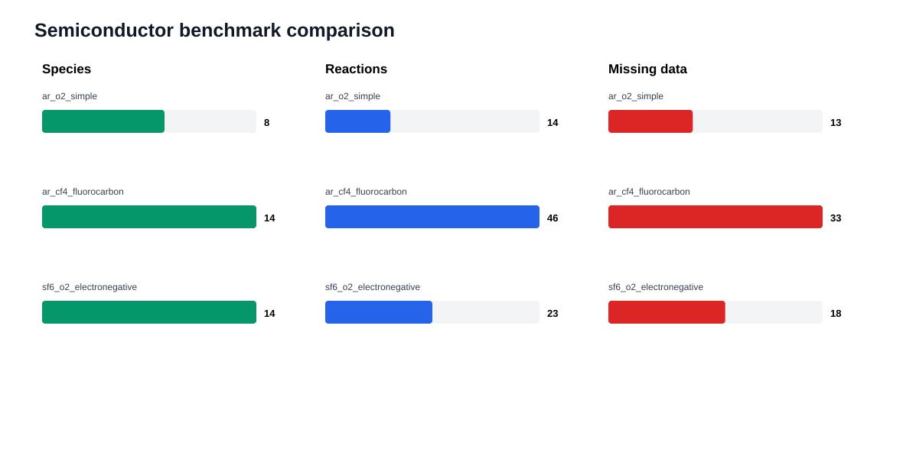

上図の系列順はspecies数、反応数、不足データ数である。本書に掲載するSVGは、評価時点の結果を第三者がそのまま確認できるよう`docs/assets/technical_report/`へ固定している。最新コードで再評価する場合は`python -m external_data_tools.run_semiconductor_benchmarks`を実行し、`benchmarks/results/`の生成物と比較する。

| Case | Species | Reactions | depth 0/1/2/3 | Xsec asset coverage | Provenance | DNT property ready | DNT complete ready | Missing |
|---|---:|---:|---|---:|---:|---:|---:|---:|
| Ar/O2 | 8 | 14 | 7 / 5 / 1 / 1 | 12.5% | 64.3% | 4/4 | 1/4 | 13 |
| Ar/CF4 | 14 | 46 | 12 / 29 / 4 / 1 | 5.0% | 8.7% | 10/12 | 0/12 | 33 |
| Ar/SF6/O2 | 14 | 23 | 10 / 11 / 1 / 1 | 13.3% | 60.9% | 4/4 | 0/4 | 18 |

実行結果:

- benchmark pass: **3/3**
- expectation score: **全case 1.0**
- validation error: **0**
- truncation: **0**
- lineage depth error: **0**
- depth 0への誤precursor付与: **0**
- 初回実行: **2.55 s**（測定環境に依存）
- 再実行: **2.68 s**（測定環境に依存）
- 再実行比較: **89 files、差分0**

> expectation score 1.0はworkflowと構造要件を満たしたことを意味し、断面積・速度係数が科学的に十分であることを意味しない。

### 8.3 Ar/O2

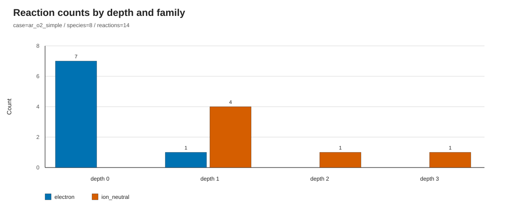

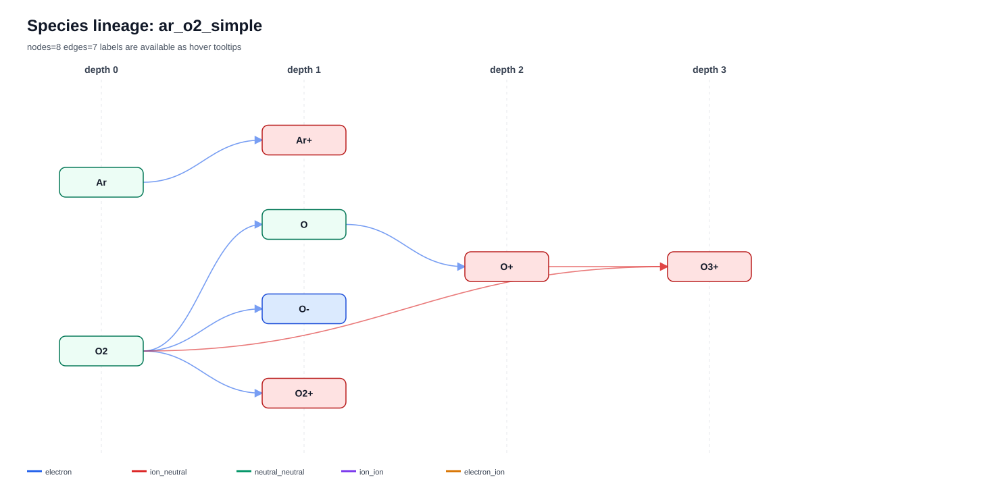

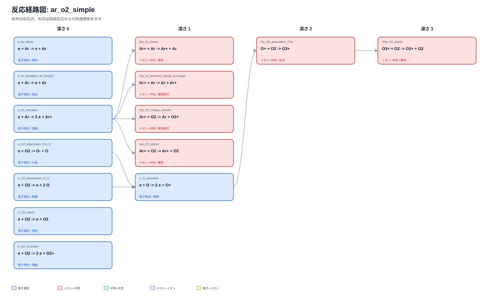

上段のspecies図はO、O2+、O-などの生成深さを示し、反応式図はそれらを生む電子衝突反応と後段のイオン–中性反応を直接読める。O2の弾性、電離、解離、付着とイオン–中性反応が生成された。4 pairすべてでDNT pair物性は揃ったが、channel threshold/energy不足により完全readyは1 pairである。

### 8.4 Ar/CF4

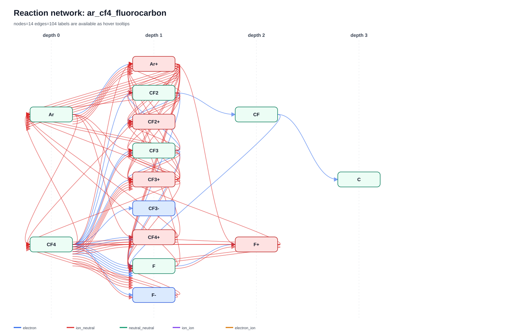

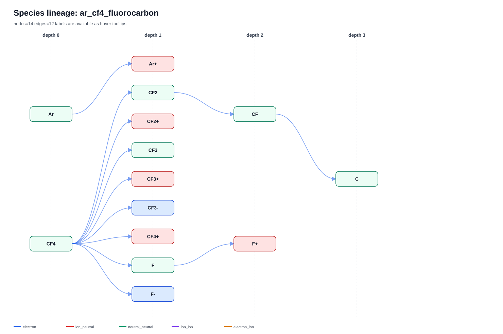

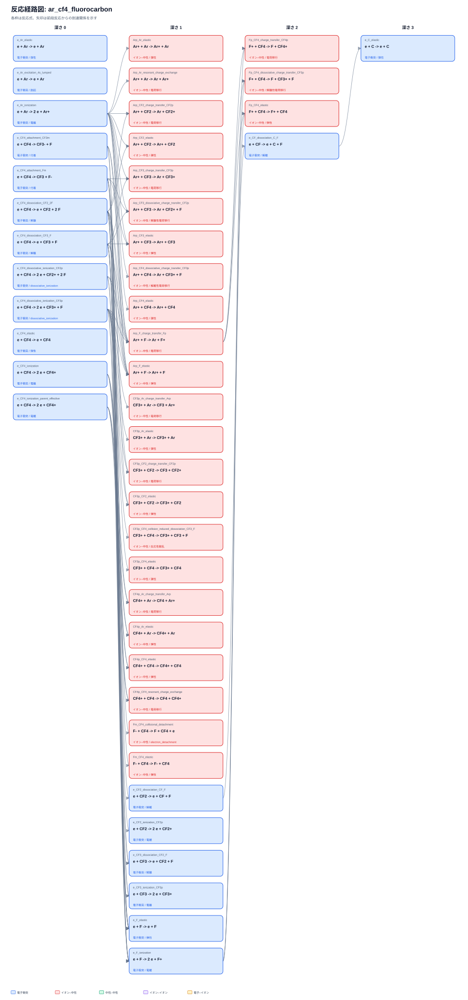

46反応のうち29反応がdepth 1に集中し、CF4からCF3、CF2、F、正負イオンが生成された後にイオン–中性反応が広がる。反応式図では、各fragmentを生じた前段反応から後段反応への分岐を式のまま確認でき、最大depth 3でCまで到達する。

主なdata gap:

- electron reactionに対する実asset断面積coverageは5.0%。
- provenance coverageは8.7%。
- 12 DNT pair中10 pairはproperty-readyだが、complete-readyは0。
- CF2の`dipole_moment_D`が不足。
- threshold不足が14件。
- 46反応中21反応が`estimated`。

このcaseはコードの多段展開stress testとして有効だが、科学機構として使用する前に最も多くのdata reviewを必要とする。

### 8.5 Ar/SF6/O2

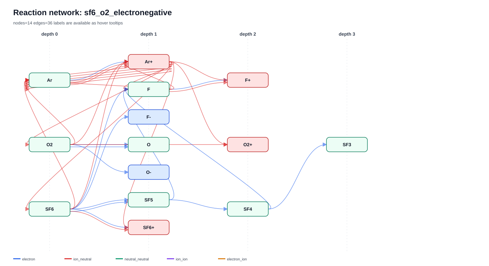

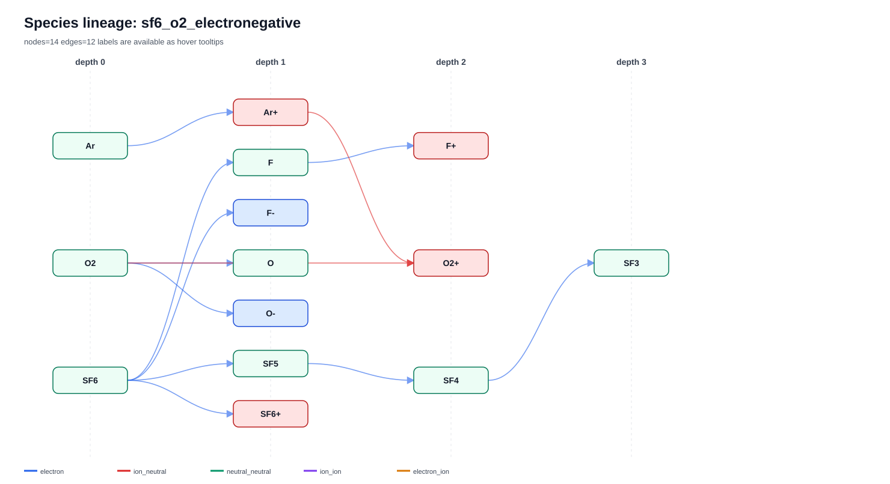

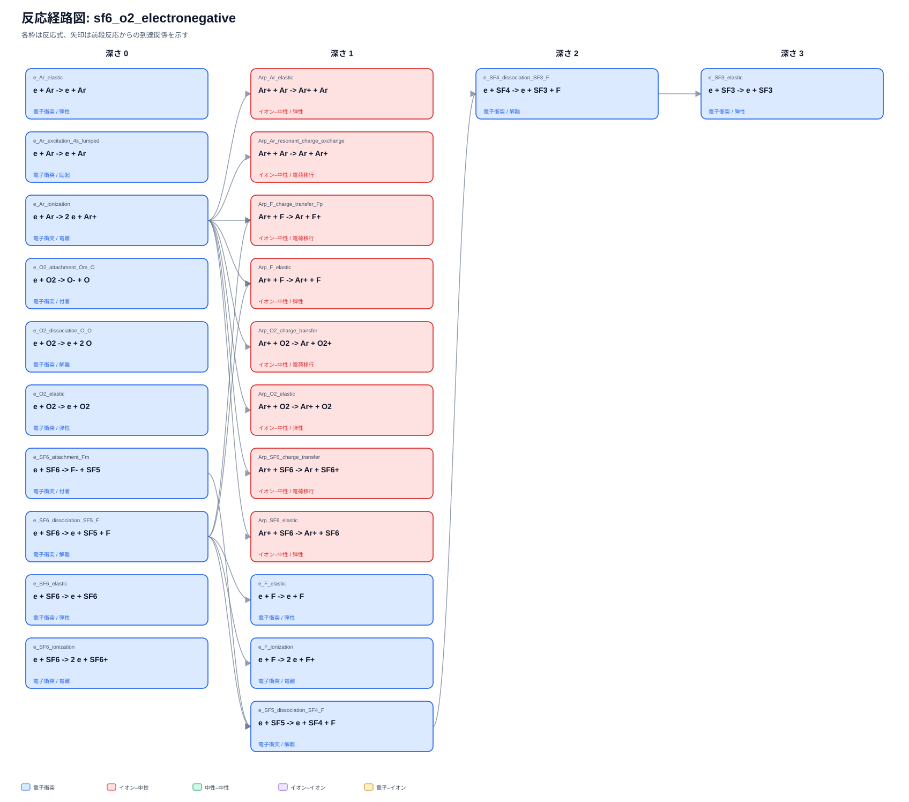

SF6とO2からF-、O-を含む負イオン系を生成し、SF5 $\rightarrow$ SF4 $\rightarrow$ SF3のlineageをdepth 3まで追跡できた。反応式図を併用すると、各depthでどの解離式またはイオン反応がspeciesを接続したかを確認できる。DNT pair物性は4/4で揃うが、channel data不足のため完全readyは0である。

### 8.6 ベンチマークから得られた設計評価

| 観点 | 評価 | 根拠 |
|---|---|---|
| 多段展開 | 良好 | 全caseでdepth 3へ到達 |
| Lineage | 良好 | depth逆転・cycle・direct reaction誤付与なし |
| 決定論性 | 良好 | 89成果物の再実行差分0 |
| 保存則 | 良好 | validation error 0 |
| Dataset実データ | 不十分 | 利用可能xsecは各case 1–2件 |
| Rate/mobility integration | 未充足 | benchmark内の利用可能dataset 0 |
| Provenance | CF4で不十分 | coverage 8.7% |
| DNT完全性 | 不十分 | complete-readyは合計1 pair |
| Family範囲 | 補助試験で確認 | neutral-neutral、ion-ion、electron-ionはsynthetic regressionで検証 |

machine-readable結果は次を参照する。

- [3ケースの集計](assets/technical_report/benchmark_summary.yaml)
- [Ar/O2の評価指標](assets/technical_report/ar_o2_metrics.yaml)
- [Ar/CF4の評価指標](assets/technical_report/ar_cf4_metrics.yaml)
- [Ar/SF6/O2の評価指標](assets/technical_report/sf6_o2_metrics.yaml)

---

## 9. 今後の拡張性

### 9.1 科学データcoverage

優先順位は次の通りである。

1. CF4、SF6、O2のreview済みelectron cross-section set。
2. ion-neutral reactionのrate coefficientと温度validity。
3. mobility dataset。
4. CF2などfragmentのdipole、polarizability、collision radius。
5. charge-transfer/dissociation channelのthresholdとreaction energy。
6. `estimated` reactionの原論文provenanceと不確かさ。

数値assetの再配布可否を`permitted`、`internal`、`site-local`で区別し、公開packへ自動同梱しない方針を維持する。

### 9.2 不確かさとvalidity

将来はdatasetへ次を追加できる。

- point-wise uncertaintyまたはparameter covariance。
- temperature/energy/pressure validity。
- recommended/preferred選択理由。
- experimental/evaluated/calculated/estimatedの品質分類。
- 同一reactionに対するdataset比較指標。

ただしcore generateはdatasetを選別・評価し過ぎず、判断根拠を明示するcatalog役に留めることが望ましい。

### 9.3 Network解析

反応リストを基礎として次へ拡張できる。

- species–reaction二部hypergraph表現。
- shortest/alternative reaction path解析。
- pathごとのdataset completeness score。
- reaction sensitivity結果の外部import。
- flux解析結果とlineageの重ね合わせ。

これらはsolverをcoreへ組み込まず、reaction IDを介した後処理として実装できる。

### 9.4 Benchmark拡張

現在のprimary benchmarkはelectron/ion-neutral中心である。次の小規模fixtureを追加すると、製品契約をより直接検証できる。

- neutral-neutral、ion-ion、electron-ionを同一caseで展開するcross-family case。
- 同一反応へ複数lineage pathが到達するcase。
- rate coefficientとmobilityを複数登録するdataset selection case。
- max pair/reaction/speciesに意図的に到達するtruncation case。
- versionの異なるregistry packを選択するresolver case。

### 9.5 出力schemaの安定化

外部シミュレータとの接続では、次を推奨する。

- output schema versionを明示する。
- reaction IDを安定識別子として使用する。
- unitと符号規約を必須化する。
- migration toolを用意し、legacy fieldを段階的に廃止する。
- YAMLを人間レビュー、CSV/JSONを機械処理へ使い分ける。

---

## 10. まとめ

`plasma-reactgen`は、入力gasから登録済み二体反応をfrontier方式で多段展開し、反応式、生成species、depth、precursor、dataset候補、DNT readiness、provenance、missing dataを決定論的に出力する。

本手法の価値は、反応機構の構造と数値データの充足状況を分離しながら、両者をreaction IDで結び付ける点にある。通常ユーザーはgasとgenerateだけを扱い、データ保守担当者はprepared registry、exact-match import、review、version付きpack buildという別の境界で作業する。

外部データについては、PubChem、明示URL、VAMDCの限定的なオンライン取得と、LXCat、NIST/ATcT、OpenADAS等のローカル原本取込みを実装している。取得結果が無審査で通常生成へ混入することはない。また、現在の反応到達判定は登録反応、保存則、frontier条件に基づき、エントロピーとGibbs自由エネルギーは使用しない。これらを将来導入する場合は、平衡・逆反応の整合性診断として反応リスト生成から分離する。

benchmarkでは多段生成、lineage、保存則、決定論性が確認された。一方、断面積、rate coefficient、mobility、reaction energetics、provenanceの不足も明確になった。したがって現段階は、**反応ネットワーク生成・レビュー製品としては有用であり、定量プラズマシミュレーションへ投入する前には対象gas系ごとのreview済みregistry pack整備が必要**と評価できる。

---

## 参考文献・関連仕様

1. L. C. Pitchford et al., “LXCat: an Open-Access, Web-Based Platform for Data Needed for Modeling Low Temperature Plasmas,” *Plasma Processes and Polymers* 14, 1600098 (2017). [DOI: 10.1002/ppap.201600098](https://doi.org/10.1002/ppap.201600098)
2. P. J. Linstrom and W. G. Mallard, “The NIST Chemistry WebBook: A Chemical Data Resource on the Internet,” *Journal of Chemical & Engineering Data* 46 (2001). [NIST publication page](https://www.nist.gov/publications/nist-chemistry-webbook-chemical-data-resource-internet)
3. NIST Standard Reference Database 69, [NIST Chemistry WebBook](https://webbook.nist.gov/)
4. IUPAC, [Periodic Table of Elements and Standard Atomic Weights](https://iupac.org/what-we-do/periodic-table-of-elements/)
5. Project specification: [`reaction_output_contract.md`](reaction_output_contract.md)
6. Project specification: [`registry_data_guide.md`](registry_data_guide.md)
7. Project specification: [`registry_packs.md`](registry_packs.md)
8. Project specification: [`dnt_input_export.md`](dnt_input_export.md)
9. Project architecture: [`product_architecture.md`](product_architecture.md)
